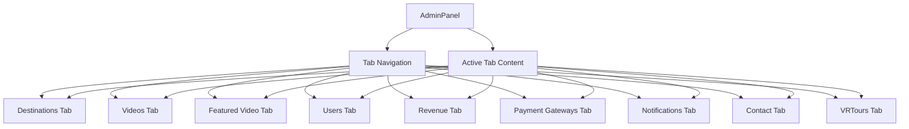

# Add Contact and VRTours Tabs to AdminPanel

## Overview

This design document outlines the implementation of two new tabs in the AdminPanel: 
1. **Contact Tab** - Allows administrators to view and manage contact inquiries from users
2. **VRTours Tab** - Provides an overview and management interface for all VR tours

The implementation will follow the existing architecture patterns used in the AdminPanel and maintain consistency with the current tab structure.

## Architecture

### Component Structure

The AdminPanel component will be extended with two new tabs:
- `ContactTab` - For managing contact inquiries
- `VRToursTab` - For managing VR tours

Both tabs will follow the same pattern as existing tabs:
- Tab navigation button in the tab bar
- Tab content component rendered when active
- Data fetching through Firebase subscriptions
- CRUD operations for data management

### Data Flow

## API Endpoints Reference

### Contact Management
Since there is no existing contact management system in the codebase, we will need to create a new Firestore collection:

- **Collection**: `contactInquiries`
- **Fields**:
  - `id`: string (Unique identifier)
  - `name`: string (User's name)
  - `email`: string (User's email)
  - `subject`: string (Inquiry subject)
  - `message`: string (Inquiry message)
  - `status`: enum ['new', 'in-progress', 'resolved', 'archived']
  - `createdAt`: Timestamp (When inquiry was created)
  - `updatedAt`: Timestamp (When inquiry was last updated)
  - `assignedTo`: string (Optional admin ID)

### VR Tours Management
VR tours are already managed through the existing `videos` collection:
- **Collection**: `videos`
- **Fields**: Already defined in the existing system

## Data Models

### Contact Inquiry Model

| Field | Type | Description |
|-------|------|-------------|
| id | string | Unique identifier |
| name | string | User's name |
| email | string | User's email |
| subject | string | Inquiry subject |
| message | string | Inquiry message |
| status | enum | Current status of inquiry |
| createdAt | Timestamp | When inquiry was created |
| updatedAt | Timestamp | When inquiry was last updated |
| assignedTo | string (optional) | Admin ID if assigned |

### VR Tour Model
The VR Tour model is already defined in the existing codebase:

| Field | Type | Description |
|-------|------|-------------|
| id | string | Unique identifier |
| title | string | Tour title |
| description | string | Tour description |
| youtubeId | string | YouTube video ID |
| embedCode | string | Embed code for video |
| duration | string | Video duration |
| destinationId | string | Associated destination |
| thumbnailUrl | string | Thumbnail image URL |
| createdAt | Timestamp | When tour was created |
| updatedAt | Timestamp | When tour was last updated |
| createdBy | string | Creator ID |
| isActive | boolean | Whether tour is active |
| isFeatured | boolean | Whether tour is featured |
| viewCount | number | Number of views |

## Business Logic Layer

### Contact Tab Implementation

1. **Data Subscription**: Subscribe to `contactInquiries` collection in Firestore
2. **Inquiry Management**:
   - View all contact inquiries
   - Update inquiry status
   - Assign inquiries to admins
   - Archive resolved inquiries
3. **Contact Details Management**:
   - View current contact information
   - Update contact details (email, phone, address)

### VRTours Tab Implementation

1. **Data Subscription**: Subscribe to `videos` collection in Firestore
2. **VR Tour Management**:
   - View all VR tours with filtering options
   - See tour statistics (view count, etc.)
   - Manage tour status (active/inactive)
   - Feature/unfeature tours
3. **Tour Analytics**:
   - View tour performance metrics
   - Filter by destination

## Component Architecture

### Updated AdminPanel Component Structure

The AdminPanel component will be modified to include the new tabs:
- Add new tab state to track active tab
- Add new state for contact data
- Add new useEffect for contact data subscription
- Render new tab components when active

### New Components

#### ContactTab Component
Responsible for displaying and managing contact inquiries:
- List view of all contact inquiries
- Ability to update inquiry status
- Form for updating contact details
- Assignment functionality for inquiries

#### VRToursTab Component
Responsible for displaying and managing VR tours:
- List view of all VR tours
- Ability to toggle tour status
- Feature/unfeature functionality
- View tour analytics and statistics

## Testing

### Unit Tests

1. **ContactTab Component Tests**:
   - Renders contact inquiries correctly
   - Updates inquiry status properly
   - Updates contact details correctly

2. **VRToursTab Component Tests**:
   - Renders VR tours correctly
   - Toggles tour status properly
   - Features/unfeatures tours correctly

3. **API Service Tests**:
   - Contact inquiries subscription function
   - Update contact inquiry status function
   - Update contact details function
   - VR tours subscription function

### Integration Tests

1. **AdminPanel Integration**:
   - Navigation between all tabs works correctly
   - Data loads properly for each tab
   - CRUD operations work for all entities

2. **Contact Management Workflow**:
   - Admin can view inquiries
   - Admin can update inquiry status
   - Admin can update contact details

3. **VR Tour Management Workflow**:
   - Admin can view all VR tours
   - Admin can toggle tour status
   - Admin can feature/unfeature tours