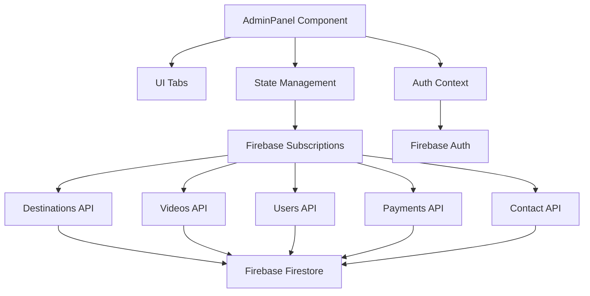

# AdminPanel Error Fixing and Firebase Firestore Integration Design

## Overview

This document outlines the design for fixing errors in the AdminPanel component and ensuring proper integration with Firebase Firestore. The AdminPanel is a critical administrative interface that manages destinations, videos, users, payments, and other system configurations.

## Architecture

The AdminPanel follows a modular architecture with the following components:

1. **UI Layer**: React component with tab-based navigation
2. **State Management**: React hooks for local state and Firebase real-time subscriptions
3. **Data Layer**: Firebase Firestore integration through dedicated API services
4. **Authentication**: Firebase Authentication with admin role verification



## Identified Issues and Fixes

### 1. Duplicate Form Elements in Payment Gateways Tab

**Issue**: The Stripe configuration form elements are duplicated multiple times in the AdminPanel component.

**Fix**: Remove duplicate form elements and ensure a single, clean implementation.

**Implementation Plan**:
- Identify and remove all duplicate Stripe configuration sections
- Keep only one complete implementation of the Stripe configuration form
- Ensure all form elements have unique names and proper event handlers

### 2. Missing Error Handling

**Issue**: The AdminPanel component lacks comprehensive error handling for Firebase operations.

**Fix**: Implement proper error handling with user feedback for all Firebase operations.

**Implementation Plan**:
- Add try-catch blocks around all Firebase API calls
- Implement error state management for each tab
- Add user-friendly error messages using toast notifications
- Add proper loading states during async operations

### 3. Incomplete Firebase Integration

**Issue**: Some features may not be properly integrated with Firebase real-time updates.

**Fix**: Ensure all data fetching uses real-time subscriptions where appropriate.

**Implementation Plan**:
- Verify all useEffect hooks properly set up Firebase subscriptions
- Ensure cleanup functions correctly unsubscribe from listeners
- Add fallback mechanisms for when Firebase is unavailable
- Implement proper data validation for Firestore documents

## API Endpoints Reference

### Destinations Management
- `subscribeToDestinations()`: Real-time listener for destinations
- `createDestination()`: Create new destination
- `updateDestination()`: Update existing destination
- `deleteDestination()`: Delete destination

### Videos Management
- `subscribeToAllVideos()`: Real-time listener for all videos
- `createVideo()`: Create new video
- `updateVideo()`: Update existing video
- `deleteVideo()`: Delete video
- `toggleVideoStatus()`: Toggle video active status

### Users Management
- `subscribeToUsers()`: Real-time listener for users
- `getAllUsers()`: Fetch all users
- `updateUserProfile()`: Update user profile

### Payments Management
- `subscribeToPaymentGatewayConfig()`: Real-time listener for payment config
- `setPaymentGatewayConfig()`: Update payment gateway configuration
- `getAllTransactions()`: Fetch all payment transactions

### Contact Management
- `subscribeToContactInquiries()`: Real-time listener for contact inquiries
- `subscribeToContactDetails()`: Real-time listener for contact details
- `updateContactInquiry()`: Update contact inquiry status
- `updateContactDetails()`: Update contact information

## Data Models & ORM Mapping

### Destination Model
```typescript
interface Destination {
  id: string;
  name: string;
  location: string;
  image: string;
  imagePublicId?: string;
  description: string;
  rating: number;
  duration: string;
  visitors: string;
  highlights: string[];
  vrAvailable: boolean;
  createdAt: Timestamp;
  updatedAt: Timestamp;
  createdBy: string;
  isActive: boolean;
}
```

### Video Model
```typescript
interface Video {
  id: string;
  title: string;
  description: string;
  youtubeId: string;
  embedCode: string;
  duration: string;
  destinationId: string;
  thumbnailUrl: string;
  createdAt: Timestamp;
  updatedAt: Timestamp;
  createdBy: string;
  isActive: boolean;
  isFeatured: boolean;
  viewCount: number;
}
```

### User Model
```typescript
interface UserProfile {
  uid: string;
  email: string;
  firstName: string;
  lastName: string;
  country: string;
  joinDate: any;
  subscription: 'free' | 'premium';
  isAdmin: boolean;
  purchasedContent: string[];
  avatarUrl?: string;
}
```

### Transaction Model
```typescript
interface Transaction {
  id: string;
  userId: string;
  userEmail: string;
  amount: number;
  currency: string;
  contentId: string;
  contentType: 'destination' | 'premium' | 'video';
  contentTitle: string;
  paymentMethod: string;
  paymentStatus: 'pending' | 'completed' | 'failed' | 'refunded';
  paymentId?: string;
  createdAt: Timestamp;
  updatedAt: Timestamp;
  metadata?: Record<string, any>;
}
```

## Business Logic Layer

### 1. Authentication Flow
The AdminPanel requires admin privileges to access. The authentication flow:
1. Verify user is authenticated through Firebase Auth
2. Check if user has admin role through custom claims
3. Redirect non-admin users to regular user interface

### 2. Data Synchronization
Real-time data synchronization through Firestore listeners:
1. Set up subscriptions for each data type on tab activation
2. Clean up subscriptions when component unmounts or tab changes
3. Handle subscription errors gracefully with fallback mechanisms

### 3. Form Validation
Client-side validation for all forms:
1. Required field validation
2. Data type validation
3. Format validation (e.g., YouTube URL format)
4. Error messaging for invalid inputs

### 4. Image Handling
Image upload and management:
1. Support for both Firebase Storage and Cloudinary
2. Proper cleanup of unused images
3. Fallback to default images when needed

## Middleware & Interceptors

### 1. Error Interception
Global error handling for Firebase operations:
1. Network error detection
2. Permission error handling
3. Fallback to mock data when Firebase is unavailable
4. User-friendly error messages

### 2. Loading State Management
Loading indicators for async operations:
1. Component-level loading states
2. Skeleton loaders for data fetching
3. Progress indicators for file uploads

## Testing Strategy

### Unit Tests
1. Test individual API functions with mock Firebase services
2. Test form validation logic
3. Test error handling scenarios
4. Test authentication flow

### Integration Tests
1. Test real-time data synchronization
2. Test CRUD operations for all entities
3. Test payment gateway configuration
4. Test notification system integration

### UI Tests
1. Test tab navigation
2. Test form submissions
3. Test error states
4. Test responsive design

## Security Considerations

1. **Admin Access Control**: Ensure only users with admin privileges can access the panel
2. **Data Validation**: Validate all inputs before storing in Firestore
3. **Error Handling**: Prevent sensitive information leakage through error messages
4. **File Upload Security**: Validate file types and sizes for uploads
5. **Payment Information**: Never store sensitive payment information in Firestore

## Performance Optimizations

1. **Pagination**: Implement pagination for large data sets
2. **Caching**: Cache frequently accessed data
3. **Lazy Loading**: Load tab content only when activated
4. **Image Optimization**: Use appropriately sized images
5. **Bundle Optimization**: Code splitting for admin panel components

## Implementation Steps

1. **Phase 1: Error Handling and Cleanup**
   - Remove duplicate form elements
   - Implement comprehensive error handling
   - Add proper loading states

2. **Phase 2: Firebase Integration**
   - Verify all real-time subscriptions
   - Implement proper cleanup functions
   - Add fallback mechanisms

3. **Phase 3: UI/UX Improvements**
   - Enhance error messaging
   - Improve loading indicators
   - Optimize form validation

4. **Phase 4: Testing**
   - Implement unit tests
   - Conduct integration testing
   - Perform UI testing

## Rollback Plan

If issues arise during deployment:
1. Revert to previous working version
2. Monitor Firebase usage and error logs
3. Communicate with admin users about the issue
4. Deploy hotfix once issue is identified and resolved