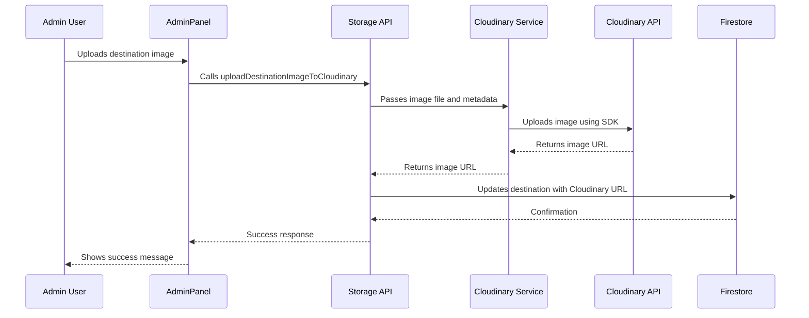

# Cloudinary Integration for Admin Panel Image Uploads

## Overview

This document outlines the design for integrating Cloudinary as the image storage solution for destination images in the admin panel. Currently, the application uses Firebase Storage for image uploads, but we will configure Cloudinary to handle destination image uploads with the provided Cloudinary credentials.

## Architecture

### Current Implementation
The application currently uses Firebase Storage for image uploads through the `uploadDestinationImage` function in `src/api/storage.ts`. This function:
1. Validates image files
2. Uploads images to Firebase Storage
3. Returns the download URL for use in the application

### Proposed Cloudinary Integration
We will modify the image upload functionality to use Cloudinary instead of Firebase Storage for destination images. The integration will:
1. Use the Cloudinary SDK for image uploads
2. Maintain the existing client-side interface for the admin panel
3. Update the storage API to support both Firebase Storage (for other use cases) and Cloudinary (for destination images)

## Component Architecture

### 1. Cloudinary Configuration Service
A new service will be created to handle Cloudinary configuration and authentication at `src/services/cloudinaryService.ts`.

This service will:
- Initialize the Cloudinary SDK with provided credentials
- Handle authentication using the API key and secret
- Provide methods for uploading, deleting, and managing images

### 2. Updated Storage API
The existing storage API will be extended to include Cloudinary-specific functions at `src/api/storage.ts`.

New functions to be added:
- `uploadDestinationImageToCloudinary`: Upload destination images to Cloudinary
- `deleteDestinationImageFromCloudinary`: Delete destination images from Cloudinary

### 3. Admin Panel Integration
The AdminPanel component will be updated to use the new Cloudinary upload function for destination images at `src/components/AdminPanel.tsx`.

Changes will include:
- Modifying the `handleSaveDestination` function to use Cloudinary for image uploads
- Maintaining the existing UI and user experience

## Data Flow



## Implementation Plan

### Phase 1: Setup and Configuration
1. Install Cloudinary SDK dependencies
2. Create Cloudinary service with authentication
3. Configure environment variables for Cloudinary credentials

### Phase 2: API Integration
1. Extend storage API with Cloudinary functions
2. Implement upload and delete functionality
3. Add error handling and validation

### Phase 3: Admin Panel Integration
1. Modify AdminPanel to use Cloudinary for destination images
2. Maintain backward compatibility for other image types
3. Update UI to show upload progress if needed

### Phase 4: Testing and Deployment
1. Test image upload functionality
2. Verify image display in destination components
3. Test error scenarios and edge cases

## API Endpoints and Interfaces

### Cloudinary Service Interface
| Function | Description |
|----------|-------------|
| uploadDestinationImage(file: File, destinationId: string) | Uploads a destination image to Cloudinary and returns metadata including URL, public ID, format, and dimensions |
| deleteDestinationImage(publicId: string) | Deletes a destination image from Cloudinary using its public ID |

### Updated Storage API Functions

New functions will be added to the storage API:

| Function | Description |
|----------|-------------|
| uploadDestinationImageToCloudinary(file: File, destinationId: string) | Uploads destination images to Cloudinary and returns a standardized result |
| deleteDestinationImageFromCloudinary(publicId: string) | Deletes destination images from Cloudinary |

## Security Considerations

1. **Credential Management**: Cloudinary API credentials will be stored as environment variables and only accessible server-side
2. **Access Control**: Only admin users will be able to upload images through the admin panel
3. **File Validation**: Maintain existing image validation (file type, size limits) for security
4. **Signed URLs**: Cloudinary will provide secure URLs for image access

## Environment Variables

The following environment variables will be added to `.env` and `.env.example`:

```
VITE_CLOUDINARY_CLOUD_NAME=dv9cwqlks
VITE_CLOUDINARY_API_KEY=113496612418175
CLOUDINARY_API_SECRET=wGlspJHbt2HvWTxY-ezH6eouJq8
```

Note: The API secret is server-side only and should NOT be prefixed with `VITE_`.

## Dependencies

The following dependencies will be added:

- cloudinary: Node.js SDK for integrating with Cloudinary API

## Migration Strategy

1. **Dual Storage Support**: Initially, both Firebase Storage and Cloudinary will be supported
2. **New Uploads**: All new destination images will be uploaded to Cloudinary
3. **Existing Images**: Existing destination images will remain in Firebase Storage until migrated
4. **Migration Script**: A future migration script can move existing images from Firebase to Cloudinary

## Testing Strategy

1. **Unit Tests**: Test Cloudinary service functions
2. **Integration Tests**: Test end-to-end upload process
3. **UI Tests**: Verify admin panel functionality
4. **Error Handling**: Test various error scenarios (network issues, invalid files, etc.)

## Performance Considerations

1. **CDN Delivery**: Cloudinary provides global CDN for faster image delivery
2. **Image Optimization**: Automatic format and quality optimization
3. **Responsive Images**: Support for responsive image delivery
4. **Caching**: Leverage Cloudinary's caching mechanisms