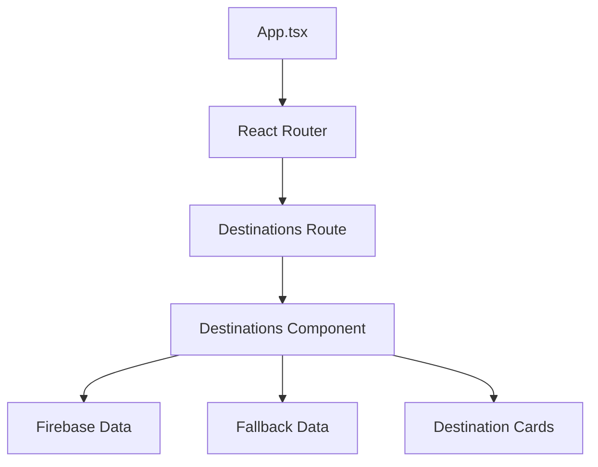

# Fix Destination Page Layout Design Document

## 1. Overview

This document outlines the design and implementation plan to fix the destination page layout issue in the desktop mode of the Incredible India travel application. Currently, when users navigate to the destination page, they are seeing raw fallback data instead of a properly formatted page with destination cards.

## 2. Problem Analysis

### Current Issues
1. **Raw Data Display**: The destination page is displaying raw JSON data instead of properly formatted destination cards
2. **Layout Inconsistency**: The page lacks proper styling and responsive design elements
3. **User Experience**: Users are unable to interact with destinations as intended

### Root Causes
1. **Routing Misconfiguration**: The `/destinations` route may not be properly configured to render the Destinations component
2. **Component Implementation**: The Destinations component may have issues with data rendering or styling
3. **Data Flow**: Potential issues with how fallback data is being passed or displayed

### Current Implementation Review
After analyzing the codebase, we found:
- The route configuration in App.tsx is correct
- The Destinations component exists and has proper structure
- The fallback data matches what the user reported seeing
- The issue appears to be that raw fallback data is being displayed instead of being properly rendered in the UI

## 3. Architecture

### Component Structure


### Data Flow
1. App.tsx defines the route for `/destinations`
2. Destinations component subscribes to destination data from Firebase
3. If Firebase data is unavailable, fallback data is used
4. Data is rendered through destination cards in a responsive grid

## 4. Solution Design

### 4.1 Fix Route Configuration
The current route configuration in App.tsx is correct:
```tsx
<Route path="/destinations" element={
  <>
    <Destinations onVRExperience={handleVRExperience} />
  </>
} />
```

However, we need to ensure the Destinations component is properly rendering the data.

### 4.2 Improve Destinations Component
The Destinations component needs the following improvements:

1. **Data Rendering**: Ensure fallback data is properly formatted and displayed
2. **Responsive Layout**: Fix CSS classes for proper desktop display
3. **Error Handling**: Improve error states and loading indicators

### 4.3 CSS Fixes
Based on the index.css file, we need to ensure:
1. Proper padding and margins for desktop view
2. Correct responsive classes for grid layouts
3. Consistent styling with other pages

## 5. Detailed Implementation Plan

### 5.1 Fix Data Display Logic
The issue appears to be in how the fallback data is being handled. Currently, the fallback data in destinations.ts is structured correctly, but it seems to be displayed as raw JSON instead of being rendered in the UI.

Key areas to check:
1. Ensure the Destinations component properly processes the fallback data
2. Verify the subscription logic correctly handles fallback data
3. Confirm the data mapping is working correctly

### 5.2 Layout Fixes
1. **Hero Section**: Ensure the animated background videos/images display properly on desktop
2. **Grid Layout**: Fix the destination cards grid to properly display on desktop screens
3. **Typography**: Ensure consistent font sizing and hierarchy across all screen sizes

### 5.3 Responsive Design
1. Maintain mobile compatibility while improving desktop experience
2. Ensure proper breakpoints for different screen sizes
3. Optimize image loading and display

## 6. Component Modifications

### 6.1 Destinations.tsx Changes
1. **Data Validation**: Add better validation for destination data
2. **Loading States**: Improve loading and error handling
3. **Fallback Handling**: Ensure fallback data is properly displayed with appropriate warnings
4. **Debugging**: Add console logs to trace data flow

### 6.2 CSS Adjustments
1. **Desktop Optimization**: Adjust padding, margins, and grid layouts for desktop
2. **Typography**: Ensure consistent font sizing and hierarchy
3. **Spacing**: Fix inconsistent spacing between elements

## 7. Specific Fixes

### 7.1 Data Rendering Issue
The main issue is that the fallback data is being shown as raw JSON. This suggests:
1. The component might not be rendering at all, showing just the data
2. There's an error in the component that prevents proper rendering
3. The data is being passed incorrectly

### 7.2 Component Structure
The Destinations component has:
- A hero section with animated background
- A destinations grid section
- Proper error/loading states
- Firebase subscription logic

### 7.3 Likely Fix Areas
1. Check if there are any JavaScript errors preventing component rendering
2. Verify the data subscription is working correctly
3. Ensure the fallback data is properly structured

## 8. Implementation Steps

### 8.1 Debug Current State
1. Add console.log statements to trace data flow in Destinations.tsx
2. Check browser console for JavaScript errors
3. Verify the component is being mounted correctly

### 8.2 Fix Data Rendering
1. Ensure the destinations data is properly mapped to destination cards
2. Verify the grid layout is correctly implemented
3. Check that all required CSS classes are applied

### 8.3 Improve Error Handling
1. Add more detailed error messages
2. Implement better fallback mechanisms
3. Ensure graceful degradation when data is unavailable

### 8.4 Optimize for Desktop
1. Adjust grid columns for larger screens
2. Optimize hero section for desktop viewing
3. Ensure proper spacing and typography scaling

## 8. Testing Strategy

### 8.1 Unit Tests
1. Test data rendering with both Firebase and fallback data
2. Verify responsive layout on different screen sizes
3. Test error handling and loading states

### 8.2 Integration Tests
1. Test route navigation to destinations page
2. Verify data flow from Firebase to component
3. Test VR experience functionality

### 8.3 UI Tests
1. Verify desktop layout and styling
2. Ensure consistent design with other pages
3. Test interactive elements (buttons, cards, etc.)

## 9. Expected Outcomes

### 9.1 Improved User Experience
- Properly formatted destination cards with images, descriptions, and ratings
- Responsive grid layout that works well on desktop screens
- Clear visual hierarchy and consistent styling

### 9.2 Performance Improvements
- Optimized image loading
- Efficient data fetching and rendering
- Smooth animations and transitions

### 9.3 Maintainability
- Clear separation of concerns in components
- Consistent code structure with existing components
- Proper error handling and logging

## 10. Verification and Testing

### 10.1 Pre-Implementation Testing
1. Document current behavior with screenshots
2. Record any console errors
3. Test on multiple browsers and devices

### 10.2 Post-Implementation Validation
1. Verify destination cards display correctly
2. Test both Firebase and fallback data scenarios
3. Check responsive behavior on different screen sizes
4. Validate all interactive elements work as expected

### 10.3 Performance Testing
1. Check page load times
2. Verify image loading optimization
3. Test smoothness of animations

## 11. Rollback Plan

If issues arise after deployment:
1. Revert to previous version of Destinations.tsx
2. Restore original CSS if layout issues persist
3. Monitor Firebase connection and fallback data functionality