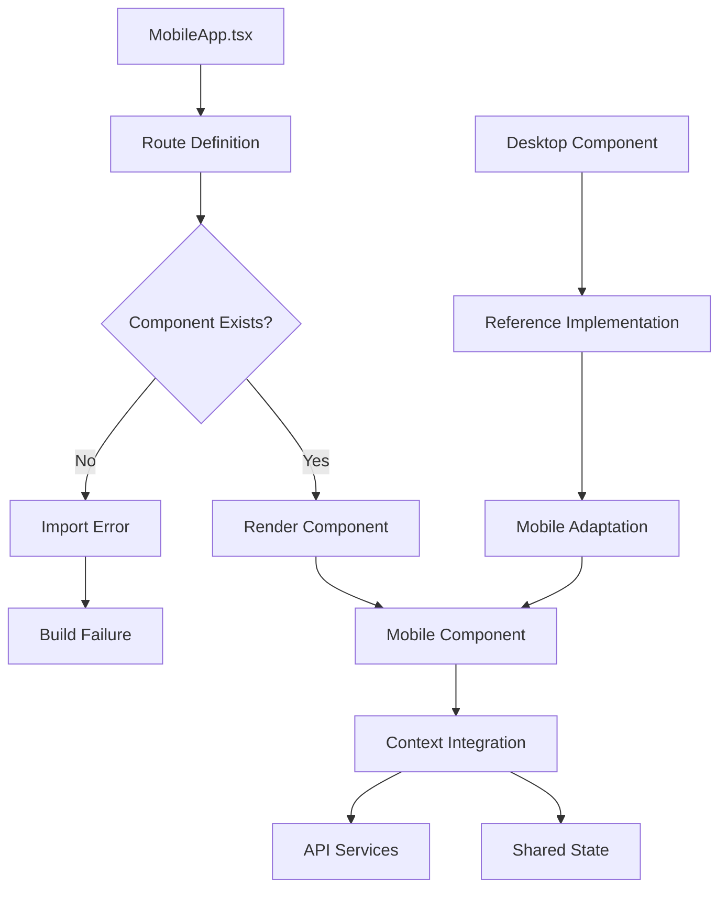
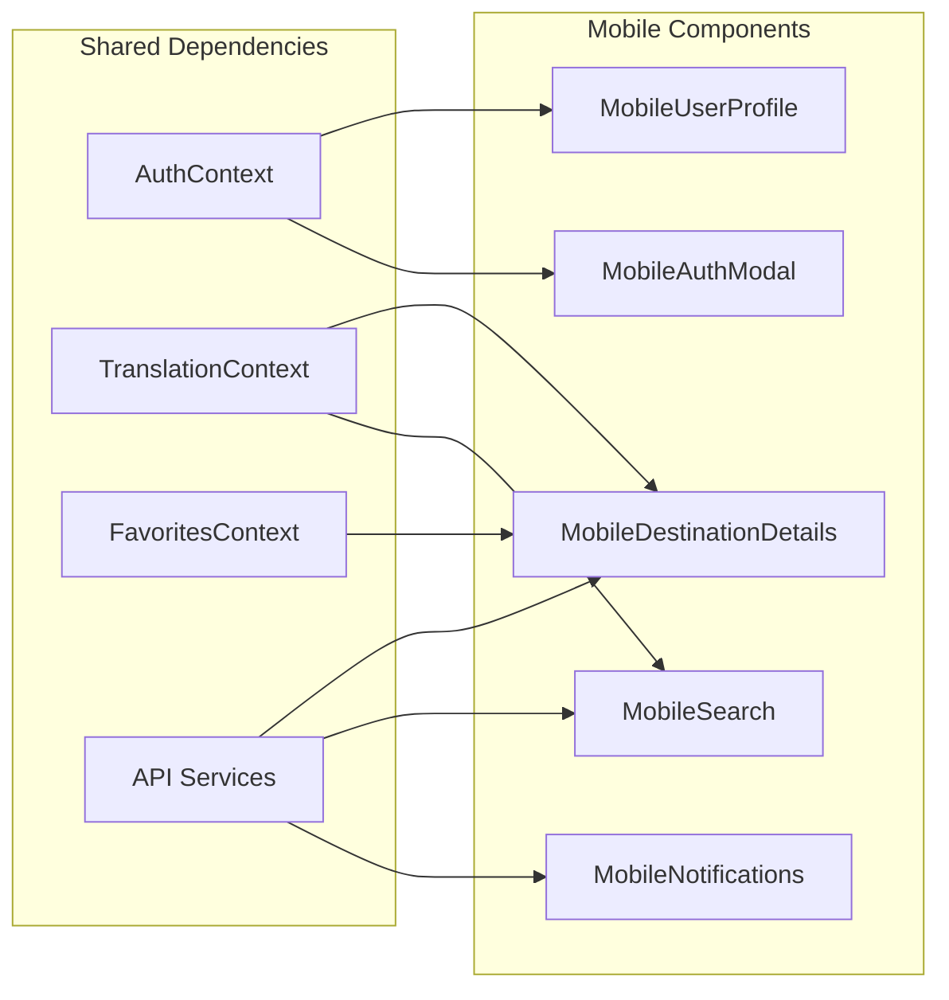
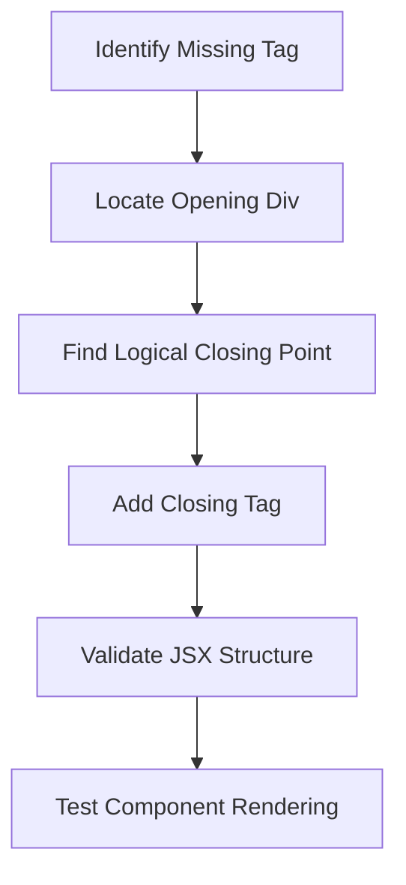

# Fix Import Path Issue - Missing Mobile Components

## Overview

The project is experiencing a build failure due to missing mobile component files. The `MobileApp.tsx` file is attempting to import several mobile components that don't exist in the `src/components/mobile/` directory, causing Vite import resolution errors.

## Technology Stack & Dependencies

- **Frontend Framework**: React 18.3.1 with TypeScript 5.5.3
- **Build Tool**: Vite 5.4.2
- **Styling**: Tailwind CSS 3.4.1
- **Routing**: React Router DOM 7.8.2
- **State Management**: React Context API
- **UI Components**: Lucide React Icons

## Architecture

### Current Component Structure

```
src/components/
├── mobile/
│   ├── [22 existing mobile components]
│   └── [5 missing components]
└── [20 desktop components including DestinationDetails.tsx]
```

### Mobile App Architecture Pattern

The application follows a responsive design pattern with:
- **Desktop Components**: Full-featured components in `src/components/`
- **Mobile Components**: Mobile-optimized versions in `src/components/mobile/`
- **Device Detection**: Automatic routing between mobile and desktop versions
- **Context Sharing**: Shared state management across both versions

## Component Analysis

### Missing Components Identification

| Component Name | Import Path | Status | Priority |
|---|---|---|---|
| `MobileDestinationDetails` | `./components/mobile/MobileDestinationDetails` | Missing | High |
| `MobileUserProfile` | `./components/mobile/MobileUserProfile` | Missing | High |
| `MobileAuthModal` | `./components/mobile/MobileAuthModal` | Missing | High |
| `MobileSearch` | `./components/mobile/MobileSearch` | Missing | Medium |
| `MobileNotifications` | `./components/mobile/MobileNotifications` | Missing | Medium |

### Existing Reference Components

| Desktop Component | Mobile Equivalent Status | Functionality |
|---|---|---|
| `DestinationDetails.tsx` | Missing → `MobileDestinationDetails` | Destination information display |
| `UserProfile.tsx` | Missing → `MobileUserProfile` | User account management |
| `AuthModal.tsx` | Missing → `MobileAuthModal` | Authentication forms |
| `SearchAndFilter.tsx` | Missing → `MobileSearch` | Search functionality |
| N/A | Missing → `MobileNotifications` | Push notifications |

## Data Flow Architecture

### Mobile Component Integration Flow



### Component Dependency Mapping



## Component Specifications

### MobileDestinationDetails Component

**Purpose**: Display detailed destination information optimized for mobile viewing

**Key Features**:
- Touch-optimized image galleries
- Swipe navigation
- Mobile-responsive layouts
- VR tour integration
- Review display and submission
- Favorites integration

**Props Interface**:
```typescript
interface MobileDestinationDetailsProps {
  destinationId?: string;
}
```

**Mobile-Specific Requirements**:
- Vertical layout prioritization
- Touch gesture support
- Performance optimization for mobile devices
- Reduced data usage
- Offline capability consideration

### MobileUserProfile Component

**Purpose**: User profile management optimized for mobile interaction

**Key Features**:
- Touch-friendly form inputs
- Photo upload with camera integration
- Settings management
- Booking history
- Favorites management

**Mobile-Specific Requirements**:
- Bottom sheet UI pattern
- Swipe gestures for navigation
- Mobile keyboard optimization
- Camera/gallery integration

### MobileAuthModal Component

**Purpose**: Authentication forms designed for mobile user experience

**Key Features**:
- Login/signup forms
- Social authentication integration
- Password reset functionality
- Form validation
- Loading states

**Mobile-Specific Requirements**:
- Full-screen modal on small devices
- Keyboard-aware layout
- Touch-optimized buttons
- Biometric authentication support

### MobileSearch Component

**Purpose**: Search and filter functionality for mobile users

**Key Features**:
- Autocomplete search
- Filter panels
- Recent searches
- Voice search integration
- Results display

**Mobile-Specific Requirements**:
- Pull-down search interface
- Swipe-to-filter gestures
- Voice input support
- Optimized result layouts

### MobileNotifications Component

**Purpose**: Push notification management and display

**Key Features**:
- Notification list display
- Push notification permissions
- In-app notification handling
- Notification settings

**Mobile-Specific Requirements**:
- Native push notification integration
- Swipe-to-dismiss functionality
- Badge counting
- Background sync support

## Implementation Strategy

### Phase 1: Core Component Creation
1. Create `MobileDestinationDetails` component based on desktop version
2. Implement mobile-specific UI patterns and touch interactions
3. Integrate with existing context providers and API services
4. Add route parameter handling for destination ID

### Phase 2: Authentication Components
1. Create `MobileAuthModal` component with mobile-optimized forms
2. Create `MobileUserProfile` component with touch-friendly interface
3. Integrate with existing AuthContext
4. Implement mobile-specific authentication flows

### Phase 3: Search and Notifications
1. Create `MobileSearch` component with mobile search patterns
2. Create `MobileNotifications` component with push notification support
3. Integrate with existing translation and state management
4. Add mobile-specific interaction patterns

### Component Development Pattern

Each mobile component should follow this architecture:

```typescript
// Component structure template
export interface Mobile[ComponentName]Props {
  // Props definition
}

const Mobile[ComponentName]: React.FC<Mobile[ComponentName]Props> = (props) => {
  // Mobile-specific hooks
  const { t } = useTranslation();
  // Other context hooks as needed
  
  // Mobile-specific state management
  // Touch gesture handling
  // Performance optimizations
  
  return (
    <div className="mobile-[component-name] [mobile-specific-classes]">
      {/* Mobile-optimized UI */}
    </div>
  );
};
```

## Mobile UI Design Patterns

### Layout Principles
- **Vertical First**: Prioritize vertical layout and scrolling
- **Touch Targets**: Minimum 44px touch targets for accessibility
- **Thumb-Friendly**: Place primary actions in thumb-reachable areas
- **Progressive Disclosure**: Show essential information first
- **Gesture Support**: Implement swipe, pinch, and tap gestures

### Visual Design Consistency
- Use consistent spacing following Tailwind CSS system
- Implement orange color scheme matching existing brand
- Apply consistent typography hierarchy
- Follow existing component naming conventions
- Maintain accessibility standards

### Performance Considerations
- Implement lazy loading for images and heavy components
- Use React.memo for performance optimization
- Minimize bundle size through code splitting
- Optimize for mobile network conditions
- Implement offline functionality where applicable

## JSX Syntax Error Resolution

### Issue Analysis

The current error in `MobileDestinations.tsx` is a missing closing `</div>` tag at line 174. The component has an unclosed div element that wraps the image container.

**Error Location**: Line 132-133 has an opening `<div className="relative">` tag that is missing its corresponding closing tag before the `<div className="p-4">` section.

### Fix Implementation



### Component Structure Correction

The correct JSX structure should be:

```jsx
<div className="relative">
  {/* Image and overlay content */}
  
  <div className="absolute top-3 right-3">
    {/* Buttons */}
  </div>
  <div className="absolute bottom-3 left-3">
    {/* Rating */}
  </div>
</div> {/* Missing closing tag */}
<div className="p-4">
  {/* Card content */}
</div>
```

### Resolution Strategy

1. **Immediate Fix**: Add the missing `</div>` tag after line 133 (after the rating div)
2. **Validation**: Ensure all opening tags have corresponding closing tags
3. **Testing**: Verify the component renders correctly after the fix

## Testing Strategy

### Unit Testing Requirements
- Component rendering tests
- Props validation tests
- Context integration tests
- Mobile-specific interaction tests
- Error boundary tests

### Mobile-Specific Testing
- Touch event simulation
- Viewport size testing
- Device orientation testing
- Performance testing on mobile devices
- Network condition testing

### Integration Testing
- Route navigation testing
- Context state management testing
- API integration testing
- Cross-component communication testing