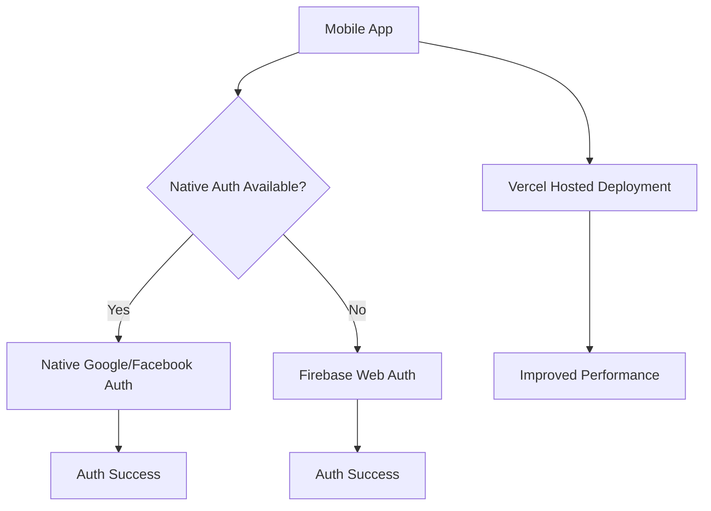

# Mobile App Authentication Improvement Design

## Overview

This document outlines the improvements needed to resolve two critical issues in the mobile application:
1. **Native Authentication**: Fix Google and Facebook authentication to use native app flows instead of browser redirects
2. **Localhost Lag**: Eliminate performance issues when the app is ported to mobile devices

The solution involves enhancing the existing Capacitor-based native authentication implementation and optimizing the mobile app deployment to use the Vercel-hosted version instead of localhost.

## Architecture

### Current Architecture Issues

1. **Authentication Flow**:
   - Mobile authentication currently falls back to browser redirects instead of using native app authentication
   - Native authentication plugin exists but is not properly integrated or prioritized
   - Redirect-based authentication causes context switching and poor user experience

2. **Deployment Configuration**:
   - Mobile app is configured to use localhost by default, causing performance issues
   - Hosted version on Vercel is available but not properly configured for mobile deployment

### Proposed Architecture Improvements



## Native Authentication Enhancement

### Current Implementation Analysis

The mobile authentication system already has:
- A `NativeAuthPlugin.java` implemented for Android with Google and Facebook authentication
- Mobile-specific authentication services in `mobileAuth.ts`
- UI components for handling authentication states

However, the current implementation has issues:
1. Native authentication is treated as a fallback rather than the primary method
2. Native plugin initialization may not be properly detecting plugin availability
3. Authentication flow doesn't prioritize native methods

### Proposed Improvements

#### 1. Native Authentication Priority Enhancement

Modify `mobileAuth.ts` to prioritize native authentication:

```typescript
// Enhanced Google authentication for mobile
export class MobileGoogleAuth {
  async signIn(): Promise<UserProfile> {
    try {
      if (isMobileDevice()) {
        // Prioritize native authentication for Capacitor apps
        if (typeof NativeAuth !== 'undefined' && NativeAuth !== null) {
          try {
            // Set UI state to authenticating
            mobileAuthUI.setState(MobileAuthState.AUTHENTICATING);
            
            // Use native authentication as primary method
            const result = await NativeAuth.signInWithGoogle();
            
            // Convert native result to Firebase user object
            const firebaseUser = {
              uid: result.uid,
              email: result.email,
              displayName: result.displayName,
              photoURL: result.photoURL
            };
            
            mobileAuthUI.setState(MobileAuthState.SUCCESS);
            const profile = await handleSocialAuthUser(firebaseUser as any);
            return profile;
          } catch (nativeError) {
            console.error('Native authentication failed:', nativeError);
            // Only fall back to web redirect if native auth fails
            mobileAuthUI.showError('Native authentication failed, using web authentication');
          }
        }
        
        // Fallback to web authentication if native is not available
        // ... existing fallback implementation
      } else {
        // Desktop implementation
        // ... existing implementation
      }
    } catch (error: any) {
      mobileAuthUI.setState(MobileAuthState.ERROR);
      throw new Error(error.message || 'Google sign-in failed');
    }
  }
}
```

#### 2. Native Plugin Initialization Enhancement

Improve the plugin initialization in `mobileAuth.ts`:

```typescript
// Capacitor plugin access for v7+
let NativeAuth: any = null;
let isNativeAuthInitialized = false;

// Enhanced initialization with better error handling
const initializeNativeAuth = async () => {
  try {
    // Check if we're in a Capacitor environment
    const isCapacitor = (window as any).Capacitor && (window as any).Capacitor.isNativePlatform && (window as any).Capacitor.isNativePlatform();
    
    if (isCapacitor) {
      // Wait for plugins to be ready
      await (window as any).Capacitor.PluginsReady;
      
      // Access the NativeAuth plugin
      const plugins = (window as any).Capacitor.Plugins;
      if (plugins && plugins.NativeAuth) {
        NativeAuth = plugins.NativeAuth;
        isNativeAuthInitialized = true;
        console.log('NativeAuth plugin initialized successfully');
        return true;
      } else {
        console.warn('NativeAuth plugin not found');
        return false;
      }
    }
  } catch (error) {
    console.error('Error initializing NativeAuth plugin:', error);
    return false;
  }
};
```

#### 3. Android Native Plugin Enhancement

Update `NativeAuthPlugin.java` with proper error handling and configuration:

```java
// In the load() method
@Override
public void load() {
    firebaseAuth = FirebaseAuth.getInstance();
    
    try {
        // Configure Google Sign-In with proper Web Client ID
        String webClientId = "YOUR_ACTUAL_WEB_CLIENT_ID"; // Should be properly configured
        
        // Check if we have a valid web client ID
        if (webClientId != null && !webClientId.equals("YOUR_ACTUAL_WEB_CLIENT_ID")) {
            GoogleSignInOptions gso = new GoogleSignInOptions.Builder(GoogleSignInOptions.DEFAULT_SIGN_IN)
                    .requestIdToken(webClientId)
                    .requestEmail()
                    .build();
            
            googleSignInClient = GoogleSignIn.getClient(this.getActivity(), gso);
        } else {
            Log.e(TAG, "Invalid Web Client ID. Please configure in NativeAuthPlugin.");
        }
    } catch (Exception e) {
        Log.e(TAG, "Error configuring Google Sign-In: " + e.getMessage());
    }
    
    // Initialize Facebook SDK
    try {
        FacebookSdk.sdkInitialize(this.getContext());
        AppEventsLogger.activateApp(this.getActivity().getApplication());
        callbackManager = CallbackManager.Factory.create();
    } catch (Exception e) {
        Log.e(TAG, "Error initializing Facebook SDK: " + e.getMessage());
    }
}
```

## Vercel Deployment Configuration

### Current Issue

The mobile app is configured to use localhost by default, causing performance issues when ported to mobile devices. The app is hosted on Vercel but not properly configured for mobile deployment.

### Solution

#### 1. Capacitor Configuration Update

Update `capacitor.config.ts` to use the Vercel-hosted URL:

```typescript
import type { CapacitorConfig } from '@capacitor/cli';

const config: CapacitorConfig = {
  appId: 'com.incredibleindia.app',
  appName: 'Incredible India',
  webDir: 'dist',
  bundledWebRuntime: false,
  server: {
    androidScheme: 'https',
    // Use the Vercel-hosted URL instead of localhost
    url: 'https://your-vercel-app-url.vercel.app',
    // Only use cleartext HTTP for development
    cleartext: false
  },
  android: {
    path: 'android'
  }
};

export default config;
```

#### 2. Environment Configuration

Ensure the mobile app uses the same Firebase configuration for both localhost and Vercel deployments by using environment variables properly.

## API Integration Layer

### Authentication Flow Enhancement

The authentication flow needs to be improved to ensure proper state management and error handling:

1. **Enhanced State Management**:
   - Improve the `MobileAuthState` enum with more granular states
   - Add proper loading indicators and user feedback
   - Implement timeout handling for authentication flows

2. **Error Handling**:
   - Add specific error messages for different failure scenarios
   - Implement retry mechanisms for transient failures
   - Provide clear user guidance for authentication issues

### Native Plugin Registration

Ensure proper plugin registration in `MainActivity.java`:

```java
public class MainActivity extends BridgeActivity {
    @Override
    public void onCreate(Bundle savedInstanceState) {
        super.onCreate(savedInstanceState);
        
        // Register custom plugins
        try {
            registerPlugin(NativeAuthPlugin.class);
            Log.d("MainActivity", "NativeAuthPlugin registered successfully");
        } catch (Exception e) {
            Log.e("MainActivity", "Error registering NativeAuthPlugin: " + e.getMessage());
        }
    }
}
```

## Business Logic Layer

### Authentication Service Enhancement

The `mobileAuth.ts` service needs enhancements to properly prioritize native authentication:

1. **Native Detection Improvements**:
   - Better detection of native plugin availability
   - Fallback mechanism improvements
   - Enhanced error handling

2. **User Experience Improvements**:
   - Better loading states and progress indicators
   - More informative error messages
   - Proper timeout handling

### Device Detection Enhancement

Improve device detection in `deviceDetection.ts`:

```typescript
export const isCapacitorNative = (): boolean => {
  try {
    return (window as any).Capacitor?.isNativePlatform() === true;
  } catch (error) {
    return false;
  }
};

export const isNativeAuthSupported = (): boolean => {
  return isCapacitorNative() && (isIOS() || isAndroid());
};
```

## Testing Strategy

### Unit Testing

1. **Native Authentication Service Testing**:
   - Test native plugin initialization
   - Test authentication flow prioritization
   - Test fallback mechanisms

2. **Device Detection Testing**:
   - Test various device detection scenarios
   - Test Capacitor environment detection

### Integration Testing

1. **Native Authentication Flow Testing**:
   - Test Google authentication on Android
   - Test Facebook authentication on Android
   - Test fallback to web authentication

2. **Deployment Configuration Testing**:
   - Test Vercel deployment configuration
   - Test performance improvements

### Manual Testing

1. **User Experience Testing**:
   - Verify native authentication flows
   - Confirm elimination of browser redirects
   - Validate performance improvements

2. **Error Handling Testing**:
   - Test error scenarios and fallbacks
   - Verify proper error messages
   - Confirm timeout handling

## Implementation Plan

### Phase 1: Native Authentication Enhancement (2-3 days)

1. Enhance native plugin initialization in `mobileAuth.ts`
2. Prioritize native authentication over web authentication
3. Improve error handling and user feedback
4. Test native authentication flows on Android devices

### Phase 2: Deployment Configuration (1-2 days)

1. Update Capacitor configuration to use Vercel URL
2. Verify Firebase configuration works with Vercel deployment
3. Test performance improvements
4. Validate authentication flows with Vercel deployment

### Phase 3: Testing and Refinement (2-3 days)

1. Conduct unit testing of authentication services
2. Perform integration testing of native authentication
3. Execute manual testing on multiple devices
4. Refine error handling and user experience

## Expected Outcomes

1. **Improved Authentication Experience**:
   - Native Google and Facebook authentication without browser redirects
   - Faster authentication flows with better user experience
   - Reduced context switching during authentication

2. **Performance Improvements**:
   - Elimination of localhost lag issues
   - Faster app loading and response times
   - Better overall mobile app performance

3. **Enhanced User Experience**:
   - Seamless authentication without leaving the app
   - More responsive UI during authentication
   - Better error handling and feedback

## Risk Mitigation

1. **Fallback Mechanisms**:
   - Maintain web authentication as fallback for native authentication failures
   - Implement graceful degradation for unsupported devices

2. **Configuration Management**:
   - Use environment variables for different deployment targets
   - Maintain separate configurations for development and production

3. **Error Handling**:
   - Implement comprehensive error handling for all authentication scenarios
   - Provide clear user feedback for authentication issues