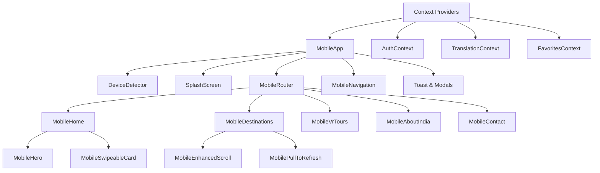

# Mobile App Redesign for Incredible India Travel Platform

## Overview

This design document outlines the comprehensive redesign of the mobile view as a dedicated Progressive Web App (PWA) for the Incredible India travel platform. The redesign transforms the existing mobile components into a native-like app experience with enhanced UI/UX, animations, effects, dynamic loaders, and advanced scrolling interactions while maintaining complete separation from the desktop experience.

## Technology Stack & Dependencies

### Core Framework
- **React 18.3.1** - Modern React with Hooks and Context API
- **TypeScript 5.5.3** - Type-safe development
- **Vite 5.4.2** - Fast development and build tool
- **React Router DOM 7.8.2** - Client-side routing

### Animation & Effects Libraries
- **Framer Motion 12.23.12** - Advanced animations and gestures
- **Tailwind CSS 3.4.1** - Utility-first CSS framework with mobile optimizations
- **Lucide React 0.344.0** - Modern icon system

### Mobile-Specific Features
- **Firebase 12.1.0** - Real-time data and authentication
- **Payment SDKs** - Paytm, Razorpay, Cashfree for mobile payments
- **PWA capabilities** - Service worker, offline support, app-like experience

## Component Architecture

### Mobile App Entry Point

```
MobileApp (Main Container)
├── Device Detection & Routing
├── Splash Screen System
├── Navigation System
├── Content Areas
└── Modal Management
```

#### Core Mobile Components Structure

**1. Navigation & Layout**
- `MobileNavigation` - Bottom navigation with haptic feedback
- `MobileBottomNavigation` - Enhanced tab system
- `MobileRouter` - Mobile-specific routing logic

**2. Enhanced UI Components**
- `MobileHome` - Animated hero sections with video backgrounds
- `MobileDestinations` - Grid layouts with pull-to-refresh
- `MobileVrTours` - Immersive VR experience interface
- `MobileAboutIndia` - Interactive content presentation
- `MobileContact` - Touch-optimized contact forms

**3. Advanced Interaction Components**
- `MobileEnhancedScroll` - Parallax and momentum scrolling
- `MobileSwipeableCard` - Gesture-based card interactions
- `MobilePullToRefresh` - Native-like refresh mechanism
- `MobileSkeletonLoader` - Dynamic loading states

**4. Native-like Features**
- `SplashScreen` - App launch experience
- `HapticFeedback` - Touch response system
- `MobilePushNotifications` - Real-time notifications
- `OfflineBanner` - Network status handling

### Component Hierarchy & Data Flow



### Props & State Management Architecture

**MobileApp State Management:**
- `destinations`: Destination[]
- `loading`: boolean  
- `showSplash`: boolean
- `isOnline`: boolean
- `modals`: Various modal states
- `toastMessage`: Notification system

**Navigation Props Interface:**
- `currentUser`: User object
- `onShowAuth`: () => void
- `onShowProfile`: () => void
- `onShowSearch`: () => void
- `onShowNotifications`: () => void

**Enhanced Components Props:**
- `onDestinationSelect`: (destination) => void
- `onVRExperience`: (destination) => void
- `onRefresh`: () => Promise<void>

## Enhanced UI/UX Features

### Animation System

#### Core Animation Types
1. **Page Transitions**
   - Fade in/out with motion blur
   - Slide transitions between routes
   - Staggered list item animations

2. **Micro-interactions**
   - Button press animations with haptic feedback
   - Card hover effects with elevation changes
   - Loading state animations with skeleton screens

3. **Gesture-based Animations**
   - Swipe-to-delete with spring physics
   - Pull-to-refresh with elastic resistance
   - Card flip animations for favorites

#### Animation Configuration
```typescript
// Framer Motion Variants
const pageVariants = {
  initial: { opacity: 0, y: 20 },
  animate: { opacity: 1, y: 0 },
  exit: { opacity: 0, y: -20 }
}

const staggerContainer = {
  animate: {
    transition: { staggerChildren: 0.1 }
  }
}
```

### Dynamic Loading System

#### Multi-layered Loading States
1. **App Launch Sequence**
   - Splash screen with brand animation
   - Progressive image preloading
   - Firebase connection establishment

2. **Content Loading**
   - Skeleton screens matching actual content
   - Progressive image loading with blur-up
   - Staggered content appearance

3. **Interaction Loading**
   - Button states with micro-spinners
   - Form submission feedback
   - Real-time data sync indicators

#### Loading Component Hierarchy
```
LoadingSystem
├── SplashScreen (2s brand intro)
├── SkeletonLoader (content placeholders)
├── ImagePreloader (progressive loading)
└── MicroLoaders (button/form states)
```

### Advanced Scrolling Effects

#### Parallax Implementation
- Hero video backgrounds with depth
- Image layers moving at different speeds
- Text content with subtle parallax offset

#### Momentum & Physics
- Native-like scroll physics
- Snap-to-section behavior
- Overscroll bounce effects
- Scroll position memory

#### Interactive Elements
- Scroll progress indicators
- Floating action buttons
- Sticky headers with opacity transitions
- Infinite scroll with performance optimization

### Haptic Feedback System

#### Touch Response Patterns
```typescript
const hapticPatterns = {
  tap: 10ms,           // Light button press
  selection: 20ms,     // Item selection
  success: [20,50,20], // Action completion
  error: [100,50,100], // Error feedback
  impact: 200ms        // Heavy interaction
}
```

## Mobile-Specific Features

### Progressive Web App (PWA) Capabilities

#### Service Worker Integration
- Offline content caching
- Background sync for favorites
- Push notification handling
- App update management

#### Native App Features
- Add to home screen prompt
- Standalone display mode
- Native status bar styling
- Hardware back button handling

### Touch Gesture System

#### Gesture Recognition
```typescript
interface TouchGestures {
  onSwipeLeft: () => void    // Navigate forward
  onSwipeRight: () => void   // Navigate back  
  onSwipeUp: () => void      // Show details
  onSwipeDown: () => void    // Dismiss/close
  onTap: () => void          // Primary action
  onLongPress: () => void    // Context menu
}
```

#### Implementation Areas
- Card interactions for destinations
- Image gallery navigation
- Modal dismissal
- Quick actions menu

### Device Integration

#### Hardware Feature Detection
```typescript
const deviceCapabilities = {
  hasCamera: boolean
  hasGPS: boolean
  hasGyroscope: boolean
  supportsHaptics: boolean
  isStandalone: boolean
}
```

#### Adaptive UI Elements
- Camera integration for AR features
- GPS-based location services
- Orientation-aware layouts
- Network-aware content loading

## State Management Architecture

### Context API Structure

#### AuthContext Enhancement
```typescript
interface MobileAuthContext {
  currentUser: User | null
  isAuthenticated: boolean
  deviceId: string
  loginMethod: 'google' | 'phone' | 'email'
  biometricEnabled: boolean
}
```

#### FavoritesContext with Sync
```typescript
interface MobileFavoritesContext {
  favorites: Destination[]
  addToFavorites: (id: string) => Promise<void>
  removeFromFavorites: (id: string) => Promise<void>
  syncOfflineFavorites: () => Promise<void>
}
```

### Local Storage Strategy
- User preferences caching
- Offline favorites storage
- Image cache management
- App state persistence

## Performance Optimization

### Rendering Optimization
- Virtual scrolling for large lists
- Image lazy loading with intersection observer
- Component memoization with React.memo
- Bundle splitting for route-based code splitting

### Memory Management
- Automatic image cleanup
- Component unmount cleanup
- Event listener cleanup
- Timer and interval cleanup

### Network Optimization
- Image compression and WebP support
- API request debouncing
- Offline-first data strategy
- Progressive data loading

## Accessibility Features

### Touch Accessibility
- Minimum 44px touch targets
- High contrast mode support
- Text scaling support
- Screen reader optimization

### Navigation Accessibility
- Keyboard navigation fallbacks
- Focus management in modals
- Skip links for main content
- ARIA labels and descriptions

## Testing Strategy

### Component Testing
- Jest unit tests for all mobile components
- React Testing Library for user interactions
- Mock implementations for device APIs
- Snapshot testing for UI consistency

### Mobile-Specific Testing
```typescript
// Example test structure
describe('MobileHome', () => {
  test('handles swipe gestures correctly', () => {})
  test('displays skeleton loaders during loading', () => {})
  test('integrates haptic feedback on interactions', () => {})
  test('maintains scroll position on navigation', () => {})
})
```

### Performance Testing
- Lighthouse mobile audits
- Bundle size monitoring
- Runtime performance profiling
- Memory leak detection

### Cross-Device Testing
- Various screen sizes and orientations
- Different mobile browsers
- iOS/Android platform differences
- Network condition variations

## Security Considerations

### Mobile Security
- Secure token storage in localStorage/sessionStorage
- HTTPS enforcement for all API calls
- Content Security Policy implementation
- Biometric authentication integration

### Data Protection
- Offline data encryption
- Secure payment processing
- User privacy controls
- GDPR compliance for mobile users

## Development Guidelines

### Mobile-First Approach
```css
/* Mobile styles first */
.mobile-component {
  /* Base mobile styles */
}

@media (min-width: 768px) {
  /* Desktop overrides only in App.tsx */
}
```

### Component Conventions
- All mobile components prefixed with "Mobile"
- Consistent prop interfaces across similar components
- Standardized animation timing and easing
- Unified error handling patterns

### Performance Guidelines
- Maximum 300KB initial bundle size
- Sub-200ms interaction response times
- Smooth 60fps animations
- Progressive enhancement principles

## Implementation Roadmap

### Phase 1: Core Architecture (Week 1)
- Enhanced MobileApp component structure
- Advanced routing system implementation
- Context API integration improvements
- Basic animation framework setup

### Phase 2: UI/UX Enhancements (Week 2)
- Implement dynamic loading systems
- Advanced scrolling effects integration
- Haptic feedback system development
- Gesture recognition implementation

### Phase 3: Performance & Polish (Week 3)
- Performance optimization implementation
- PWA features integration
- Accessibility improvements
- Cross-device testing and fixes

### Phase 4: Advanced Features (Week 4)
- Push notifications system
- Offline functionality enhancement
- Advanced animations and transitions
- Security and testing improvements