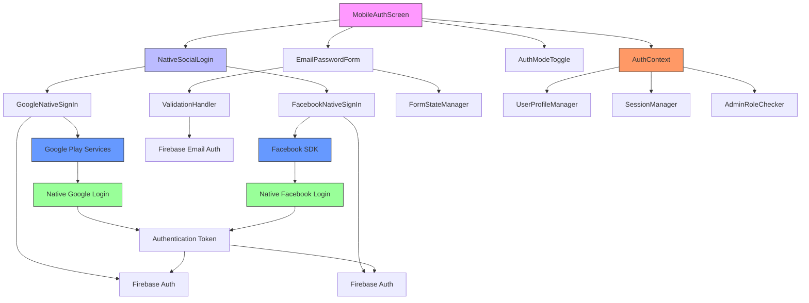
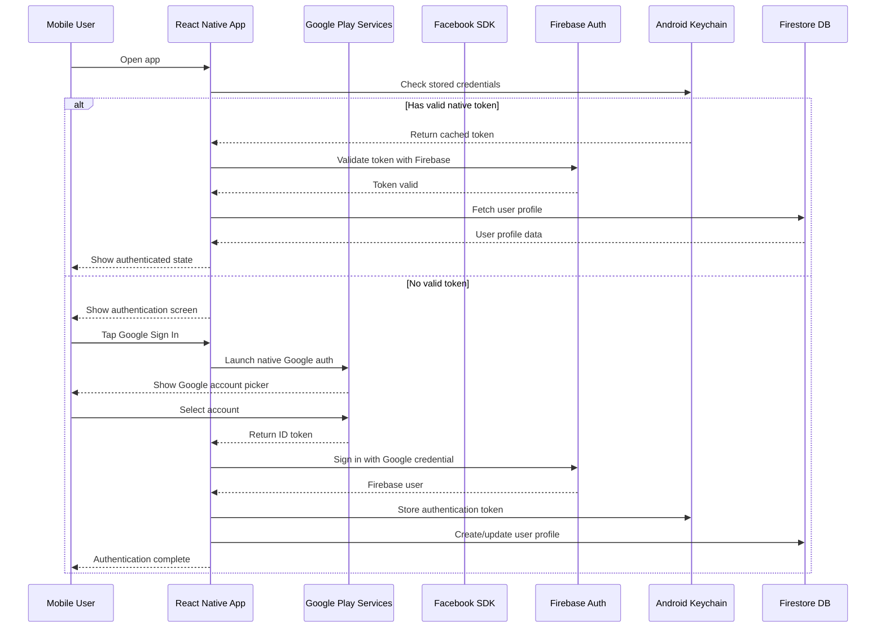
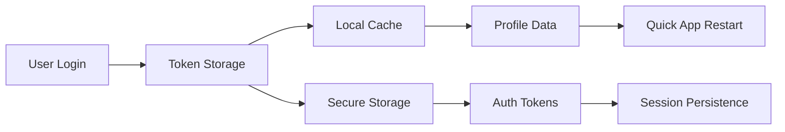

# Mobile Authentication Design

## Overview

This design specifies the implementation of mobile authentication for the Incredible India tourism platform, focusing on Google and Facebook social login integration alongside traditional email/password authentication. The system leverages Firebase Authentication for secure user management and provides a seamless mobile-first user experience.

## Technology Stack & Dependencies

**Core Authentication Services:**
- Firebase Authentication v10.x
- Google Auth Provider
- Facebook Auth Provider
- React Context API for state management

**Native Mobile Technologies:**
- React Native for cross-platform mobile app
- Google Sign-In SDK for Android
- Facebook Login SDK for Android
- Native authentication flows
- Deep linking support

**Android-Specific Dependencies:**
- @react-native-google-signin/google-signin
- react-native-fbsdk-next
- @react-native-firebase/auth
- react-native-keychain (secure storage)

**Required Dependencies:**
```json
{
  "@react-native-firebase/app": "^18.x",
  "@react-native-firebase/auth": "^18.x",
  "@react-native-google-signin/google-signin": "^10.x",
  "react-native-fbsdk-next": "^12.x",
  "react-native-keychain": "^8.x",
  "react-native-vector-icons": "^10.x"
}
```

**Android Configuration Requirements:**
```xml
<!-- android/app/src/main/res/values/strings.xml -->
<resources>
    <string name="facebook_app_id">YOUR_FACEBOOK_APP_ID</string>
    <string name="fb_login_protocol_scheme">fbYOUR_FACEBOOK_APP_ID</string>
    <string name="facebook_client_token">YOUR_FACEBOOK_CLIENT_TOKEN</string>
</resources>
```

## Component Architecture

### Authentication Flow Components



### Component Hierarchy

**MobileAuthScreen (Root Component)**
- NativeSocialLoginSection
  - GoogleNativeSignInButton
  - FacebookNativeSignInButton
  - NativeSocialLoginHandler
- EmailPasswordSection
  - EmailInput
  - PasswordInput (with visibility toggle)
  - FirstNameInput (signup only)
  - LastNameInput (signup only)
  - CountrySelector (signup only)
- FormControls
  - SubmitButton
  - LoadingSpinner
  - ErrorDisplay
- AuthModeToggle
  - LoginModeButton
  - SignupModeButton
- BiometricAuthOption (Android)
  - FingerprintAuth
  - FaceAuth

## API Integration Layer

### Native Android Authentication Setup

**Google Sign-In Native Integration:**
```typescript
import { GoogleSignin } from '@react-native-google-signin/google-signin';
import auth from '@react-native-firebase/auth';

interface GoogleNativeConfig {
  webClientId: string;
  offlineAccess: boolean;
  hostedDomain?: string;
  forceCodeForRefreshToken: boolean;
  accountName?: string;
  googleServicePlistPath?: string;
  openIdNonce?: string;
}

const configureGoogleSignIn = (): void => {
  GoogleSignin.configure({
    webClientId: 'YOUR_WEB_CLIENT_ID.apps.googleusercontent.com',
    offlineAccess: true,
    hostedDomain: '',
    forceCodeForRefreshToken: true,
  });
};

const signInWithGoogleNative = async (): Promise<UserProfile> => {
  try {
    // Check if device supports Google Play Services
    await GoogleSignin.hasPlayServices({ showPlayServicesUpdateDialog: true });
    
    // Get user info from Google
    const { idToken, user } = await GoogleSignin.signIn();
    
    // Create Firebase credential
    const googleCredential = auth.GoogleAuthProvider.credential(idToken);
    
    // Sign in with Firebase
    const userCredential = await auth().signInWithCredential(googleCredential);
    
    return await createOrUpdateUserProfile(userCredential.user, 'google', user);
  } catch (error) {
    throw new GoogleSignInError(error);
  }
};
```

**Facebook Login Native Integration:**
```typescript
import { LoginManager, AccessToken } from 'react-native-fbsdk-next';
import auth from '@react-native-firebase/auth';

interface FacebookNativeConfig {
  permissions: string[];
  loginBehavior: 'native_with_fallback' | 'native_only' | 'web_only';
}

const signInWithFacebookNative = async (): Promise<UserProfile> => {
  try {
    // Attempt native Facebook login
    const result = await LoginManager.logInWithPermissions([
      'public_profile',
      'email'
    ]);
    
    if (result.isCancelled) {
      throw new Error('User cancelled the login process');
    }
    
    // Get Facebook access token
    const data = await AccessToken.getCurrentAccessToken();
    
    if (!data) {
      throw new Error('Something went wrong obtaining access token');
    }
    
    // Create Firebase credential
    const facebookCredential = auth.FacebookAuthProvider.credential(data.accessToken);
    
    // Sign in with Firebase
    const userCredential = await auth().signInWithCredential(facebookCredential);
    
    return await createOrUpdateUserProfile(userCredential.user, 'facebook');
  } catch (error) {
    throw new FacebookSignInError(error);
  }
};
```

### Authentication API Methods

**Native Authentication Flow:**
```typescript
interface NativeAuthResult {
  user: UserProfile;
  isNewUser: boolean;
  provider: 'google' | 'facebook';
  nativeUserData: GoogleUser | FacebookUser;
}

const handleNativeAuthentication = async (
  provider: 'google' | 'facebook'
): Promise<NativeAuthResult> => {
  // 1. Initialize native SDK
  // 2. Trigger native authentication UI
  // 3. Handle user interaction with native dialog
  // 4. Extract authentication credentials
  // 5. Convert to Firebase credential
  // 6. Authenticate with Firebase
  // 7. Create or update user profile
  // 8. Return comprehensive result
};
```

**Android Native Integration Points:**
```typescript
interface AndroidAuthIntegration {
  // Google Play Services integration
  googlePlayServices: {
    checkAvailability: () => Promise<boolean>;
    requestUpdate: () => Promise<void>;
    handleResolution: (resultCode: number) => void;
  };
  
  // Facebook SDK integration
  facebookSDK: {
    initializeSDK: (appId: string, clientToken: string) => void;
    handleActivityResult: (requestCode: number, resultCode: number, data: Intent) => void;
    getCurrentProfile: () => Promise<FacebookProfile | null>;
  };
  
  // Deep linking handling
  deepLinking: {
    handleAuthCallback: (url: string) => Promise<void>;
    registerCustomScheme: (scheme: string) => void;
  };
}
```

**User Profile Management:**
```typescript
interface UserProfileCreation {
  uid: string;
  email: string;
  firstName: string;
  lastName: string;
  country: string;
  provider: 'google' | 'facebook' | 'email';
  avatarUrl?: string;
  socialId?: string;
  nativeAuthData?: NativeAuthMetadata;
}

interface NativeAuthMetadata {
  googlePlayServicesVersion?: string;
  facebookSDKVersion?: string;
  deviceFingerprint: string;
  authenticationMethod: 'native' | 'webview';
  lastAuthenticationTime: number;
}

const createNativeUserProfile = async (
  firebaseUser: FirebaseUser,
  provider: string,
  nativeUserData: any
): Promise<UserProfile> => {
  // Extract comprehensive user data from native authentication
  // Include device-specific metadata for security
  // Store profile with native authentication markers
  // Handle profile picture from native social account
  // Set up secure local storage for quick re-authentication
};
```

## State Management

### Authentication Context Enhancement

**Enhanced Auth State:**
```typescript
interface AuthContextType {
  currentUser: UserProfile | null;
  loading: boolean;
  isAdmin: boolean;
  authProvider: 'google' | 'facebook' | 'email' | null;
  nativeAuthStates: NativeAuthStates;
  biometricAuthAvailable: boolean;
  
  // Native authentication methods
  signInWithGoogleNative: () => Promise<void>;
  signInWithFacebookNative: () => Promise<void>;
  signInWithEmail: (credentials: EmailCredentials) => Promise<void>;
  signUpWithEmail: (userData: SignUpData) => Promise<void>;
  signOut: () => Promise<void>;
  
  // Native-specific methods
  linkNativeAccount: (provider: string) => Promise<void>;
  unlinkNativeAccount: (provider: string) => Promise<void>;
  refreshUserProfile: () => Promise<void>;
  enableBiometricAuth: () => Promise<void>;
  authenticateWithBiometric: () => Promise<void>;
}
```

**Native Authentication State Management:**
```typescript
interface NativeAuthStates {
  google: {
    isLoading: boolean;
    error: string | null;
    isLinked: boolean;
    playServicesAvailable: boolean;
    lastSignInTime?: number;
  };
  facebook: {
    isLoading: boolean;
    error: string | null;
    isLinked: boolean;
    sdkInitialized: boolean;
    lastSignInTime?: number;
  };
  biometric: {
    isAvailable: boolean;
    isEnabled: boolean;
    supportedTypes: BiometricType[];
    lastAuthTime?: number;
  };
}

interface BiometricType {
  fingerprint: boolean;
  face: boolean;
  iris: boolean;
  voice: boolean;
}
```

### Session Management

**Native Authentication Persistence:**


## Native Mobile UI Design Specifications

### Android Authentication Screen Layout

**Native Android Design Principles:**
- Material Design 3 components
- Native Android navigation patterns
- Android-specific touch targets (48dp minimum)
- System UI integration (status bar, navigation bar)
- Adaptive layouts for different screen sizes
- Dark mode support

**Native Authentication Flow:**
```
┌─────────────────────────────────────┐
│  [Status Bar - System Managed]     │
├─────────────────────────────────────┤
│                                     │
│         App Logo & Title            │
│                                     │
│  ┌─────────────────────────────┐    │
│  │  🔴 Continue with Google    │    │ ← Launches native Google picker
│  └─────────────────────────────┘    │
│                                     │
│  ┌─────────────────────────────┐    │
│  │  🔵 Continue with Facebook  │    │ ← Launches native Facebook auth
│  └─────────────────────────────┘    │
│                                     │
│  ──────────── or ───────────────    │
│                                     │
│  [Email Input Field]                │
│  [Password Input Field] 👁          │
│  [First Name] [Last Name]           │
│                                     │
│  [Continue Button - Full Width]     │
│                                     │
│  [Biometric Auth Option] 👆         │
│                                     │
│         Switch to Sign Up           │
│                                     │
├─────────────────────────────────────┤
│  [Navigation Bar - System Managed] │
└─────────────────────────────────────┘
```

### Native Button Design Specifications

**Google Sign-In Button (Native):**
- Follows Google Brand Guidelines
- Material Design elevated button style
- Height: 48dp (Android standard)
- Google logo + "Continue with Google" text
- Light/Dark theme variants
- Ripple effect on touch
- Loading state with circular progress

**Facebook Login Button (Native):**
- Follows Facebook Brand Guidelines
- Facebook blue (#1877F2)
- Height: 48dp (Android standard) 
- Facebook logo + "Continue with Facebook" text
- Rounded corners (8dp)
- Touch feedback with elevation change
- Loading state with spinner

**Biometric Authentication Button:**
- Android system icons (fingerprint/face)
- Outlined button style
- Adaptive icon based on available biometric type
- System haptic feedback on touch
- Security-focused visual design

**Accessibility Features:**
- TalkBack support for screen readers
- Minimum touch target size (48dp)
- High contrast mode support
- Content descriptions for all interactive elements
- Focus indicators for external keyboards
- Voice access compatibility

## Security & Error Handling

### Native Security Implementation

**Android Native OAuth Security:**
```typescript
interface NativeSecurityMeasures {
  // Android App Links verification
  appLinksVerification: {
    digitalAssetLinks: boolean;
    intentFilters: string[];
    autoVerify: boolean;
  };
  
  // Certificate pinning for API calls
  certificatePinning: {
    googleApiPins: string[];
    facebookApiPins: string[];
    firebaseApiPins: string[];
  };
  
  // Android Keystore integration
  keystoreIntegration: {
    biometricKey: string;
    encryptionAlgorithm: 'AES-256-GCM';
    keyValidityDuration: number;
  };
  
  // SafetyNet attestation
  safetyNetAttestation: {
    enabled: boolean;
    apiKey: string;
    nonceGeneration: () => string;
  };
}
```

**Native Authentication Token Security:**
```typescript
interface TokenSecurityConfig {
  // Android Keychain storage
  secureStorage: {
    service: 'GoogleAuth' | 'FacebookAuth';
    encryption: 'hardware' | 'software';
    biometricRequirement: boolean;
    accessControl: 'BiometryAny' | 'BiometryCurrentSet';
  };
  
  // Token refresh strategy
  tokenRefresh: {
    refreshThreshold: number; // seconds before expiry
    maxRetryAttempts: number;
    exponentialBackoff: boolean;
  };
  
  // Anti-tampering measures
  antiTampering: {
    rootDetection: boolean;
    debuggerDetection: boolean;
    hookingDetection: boolean;
  };
}
```

**Data Privacy Compliance:**
- Minimal data collection from social providers
- User consent for profile information access
- Secure token storage
- Regular token refresh
- Account deletion capabilities

### Error Handling Strategy

**Error Categories:**
```typescript
enum NativeAuthErrorTypes {
  // Native SDK errors
  GOOGLE_PLAY_SERVICES_UNAVAILABLE = 'google_play_services_unavailable',
  FACEBOOK_SDK_NOT_INITIALIZED = 'facebook_sdk_not_initialized',
  
  // Authentication specific
  INVALID_CREDENTIALS = 'invalid_credentials',
  ACCOUNT_EXISTS = 'account_exists',
  PERMISSION_DENIED = 'permission_denied',
  TOKEN_EXPIRED = 'token_expired',
  
  // Device specific
  BIOMETRIC_NOT_AVAILABLE = 'biometric_not_available',
  DEVICE_NOT_SUPPORTED = 'device_not_supported'
}

interface NativeAuthErrorHandler {
  handleGooglePlayServicesError: (error: GoogleError) => UpdatePrompt;
  handleFacebookSDKError: (error: FacebookError) => RetryStrategy;
  handleBiometricError: (error: BiometricError) => FallbackAuth;
}
```

**User-Friendly Error Messages:**
- Google Play Services outdated or unavailable
- Facebook app not installed or login cancelled
- Biometric authentication not set up
- Network connectivity issues
- Account security restrictions

## Testing Strategy

### Authentication Flow Testing

**Native Integration Tests:**
- Google Play Services availability and version checks
- Facebook SDK initialization and configuration
- Native authentication UI launching and interaction
- Token exchange between native SDKs and Firebase
- Biometric authentication enrollment and usage
- Deep linking handling for authentication callbacks

**Mobile-Specific Testing:**
- Touch interaction with native authentication UI
- Device rotation during authentication flow
- App backgrounding and foregrounding during auth
- Network interruption during native authentication
- Multiple account selection in native pickers
- Permission handling for biometric authentication

### Test Scenarios

**Google Native Authentication:**
```typescript
describe('Google Native Authentication', () => {
  test('launches native Google account picker');
  test('handles Google Play Services unavailable');
  test('processes successful Google sign-in');
  test('manages account switching in picker');
  test('handles user cancellation gracefully');
});
```

**Facebook Native Authentication:**
```typescript
describe('Facebook Native Authentication', () => {
  test('launches native Facebook login');
  test('handles Facebook app not installed');
  test('processes successful Facebook login');
  test('manages permission requests');
  test('handles login cancellation');
});
```

## Performance Optimization

### Mobile Performance Considerations

**Bundle Size Optimization:**
- Code splitting for authentication modules
- Lazy loading of social provider SDKs
- Tree shaking of unused Firebase features
- Compression of authentication assets

**Network Optimization:**
- Efficient token caching
- Minimal API calls during authentication
- Optimized profile image loading
- Retry mechanisms for failed requests

**User Experience Optimization:**
- Fast authentication state restoration
- Progressive loading indicators
- Smooth transitions between auth states
- Predictive preloading of user data

### Caching Strategy

**Authentication Cache:**


## Implementation Roadmap

### Phase 1: Foundation Setup
1. Configure Firebase Authentication providers
2. Update authentication API methods
3. Enhance MobileAuthModal with social buttons
4. Implement basic Google and Facebook sign-in

### Phase 2: Enhanced User Experience
1. Add sophisticated error handling
2. Implement loading states and animations
3. Add account linking functionality
4. Optimize mobile UI/UX

### Phase 3: Advanced Features
1. Implement biometric authentication option
2. Add multi-factor authentication support
3. Develop comprehensive analytics
4. Performance optimization and monitoring

### Phase 4: Security & Compliance
1. Security audit and penetration testing
2. Privacy compliance verification
3. User data management features
4. Documentation and training completion