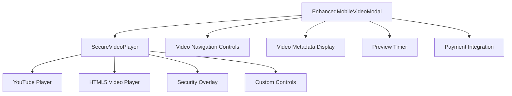
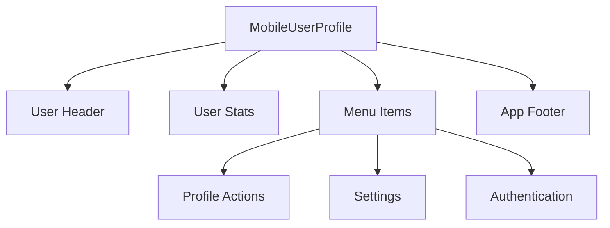
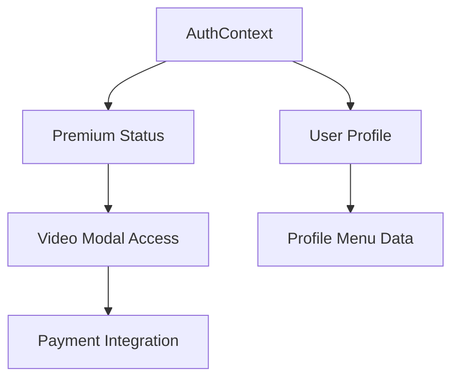

# Mobile Video Modal Design (YouTube-like Experience)

## 1. Overview

This document outlines the design for a mobile video modal that provides a YouTube-like experience for viewing destination videos on mobile devices. The design focuses on proper dimensions, responsive behavior, and seamless integration with the existing mobile UI components. Additionally, it addresses the functionality of the mobile profile menu to ensure all features work correctly on both desktop and mobile platforms.

## 2. Design Requirements

### 2.1 Mobile Video Modal Requirements
- YouTube-like dimensions and layout
- Responsive design that adapts to portrait and landscape orientations
- Proper aspect ratio handling for video content
- Intuitive controls and navigation
- Premium access restrictions with preview functionality
- Error handling and loading states

### 2.2 Mobile Profile Menu Requirements
- Proper functionality across all devices
- Consistent design with the mobile app theme
- Access to user profile features
- Smooth animations and transitions

### 2.3 Cross-Platform Compatibility
- Consistent behavior on both desktop and mobile
- Responsive design that adapts to different screen sizes
- Unified codebase with platform-specific optimizations

## 3. Mobile Video Modal Architecture

### 3.1 Component Structure

### 3.2 Key Features

#### 3.2.1 Video Player Integration
- YouTube iframe API integration for secure video playback
- HTML5 video fallback for direct video sources
- Custom controls overlay with YouTube-style UI
- Security measures to prevent unauthorized access

#### 3.2.2 Responsive Dimensions
- Portrait mode: Full-width player with reduced height
- Landscape mode: Full-screen player with hidden UI elements
- Aspect ratio preservation (16:9 standard)
- Safe area handling for notched devices

#### 3.2.3 Orientation Handling
- Automatic detection of device orientation
- Screen rotation lock functionality
- UI adjustments based on orientation
- Fullscreen landscape mode optimization

#### 3.2.4 Premium Access Control
- 60-second preview timer for non-premium users
- Visual countdown indicator
- Payment modal integration
- Access restoration after payment

### 3.3 UI/UX Design

#### 3.3.1 Video Player Controls
| Control | Function | Position |
|---------|----------|----------|
| Play/Pause | Toggle playback | Center overlay |
| Progress Bar | Seek through video | Bottom |
| Volume | Adjust audio | Bottom left |
| Fullscreen | Toggle fullscreen mode | Bottom right |
| Settings | Playback speed/quality | Bottom right |
| Close | Exit modal | Top right |

#### 3.3.2 Navigation Elements
- Swipe gestures for video navigation
- Dot indicators for multiple videos
- Horizontal scrolling video list
- Thumbnail previews for related content

#### 3.3.3 Visual Design
- Glass morphism effects for UI elements
- Dark theme for immersive viewing
- Orange/red accent colors for branding
- Smooth animations using Framer Motion

## 4. Mobile Profile Menu Architecture

### 4.1 Component Structure

### 4.2 Key Features

#### 4.2.1 User Information Display
- Profile picture with fallback to default icon
- User name and email display
- Statistics dashboard (destinations visited, tours completed, favorites)

#### 4.2.2 Menu Functionality
- Edit Profile option
- Favorites management
- Viewing history
- App settings
- Help and support
- Sign out functionality

#### 4.2.3 UI/UX Design
- Bottom sheet modal with swipe-to-close
- Smooth entrance/exit animations
- Gradient header with user information
- Consistent iconography using Lucide React
- Haptic feedback for interactions

## 5. Cross-Platform Implementation

### 5.1 Shared Components
- Context API for authentication state
- Responsive design using Tailwind CSS
- Conditional rendering based on device detection
- Unified styling system with CSS variables

### 5.2 Platform-Specific Optimizations

#### 5.2.1 Mobile Optimizations
- Touch-friendly controls with appropriate sizing
- Haptic feedback for interactions
- Performance optimizations for lower-end devices
- PWA installation prompt integration

#### 5.2.2 Desktop Optimizations
- Keyboard shortcut support
- Mouse hover effects
- Larger clickable areas
- Multi-window support

### 5.3 State Management

## 6. API Integration Layer

### 6.1 Video Data
- `getVideosByDestination(destinationId)` - Fetch videos for a destination
- YouTube iframe API for video playback
- Error handling for unavailable videos

### 6.2 User Authentication
- Firebase Authentication integration
- Premium status management
- Profile data synchronization

### 6.3 Payment Processing
- Payment modal component
- Success/failure callbacks
- Premium status update after payment

## 7. Security Considerations

### 7.1 Video Protection
- YouTube iframe security overlay
- Context menu blocking
- Keyboard shortcut restrictions
- Direct URL access prevention

### 7.2 User Data Protection
- Firebase security rules
- Secure token handling
- Private route protection

## 8. Performance Optimization

### 8.1 Video Loading
- Lazy loading of video data
- Preloading of thumbnails
- Error boundaries for failed loads
- Progressive enhancement

### 8.2 UI Performance
- Virtualized lists for video navigation
- Optimized animations with Framer Motion
- Efficient re-rendering with React.memo
- Code splitting for mobile components

## 9. Testing Strategy

### 9.1 Unit Testing
- Component rendering tests
- State management verification
- Event handler testing
- API integration testing

### 9.2 Integration Testing
- Cross-platform functionality verification
- Authentication flow testing
- Payment process validation
- Orientation change handling

### 9.3 User Experience Testing
- Touch interaction validation
- Accessibility compliance
- Performance benchmarking
- Device compatibility testing