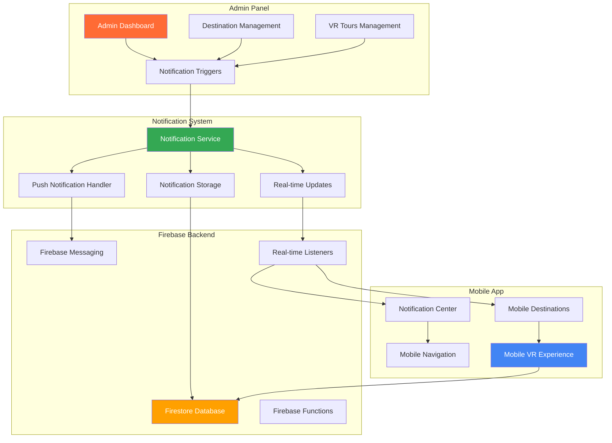
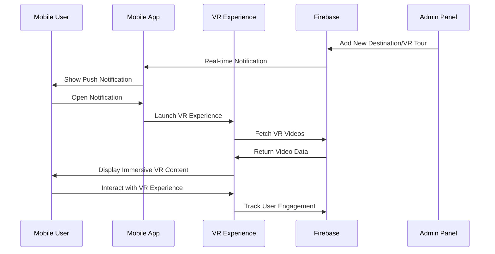
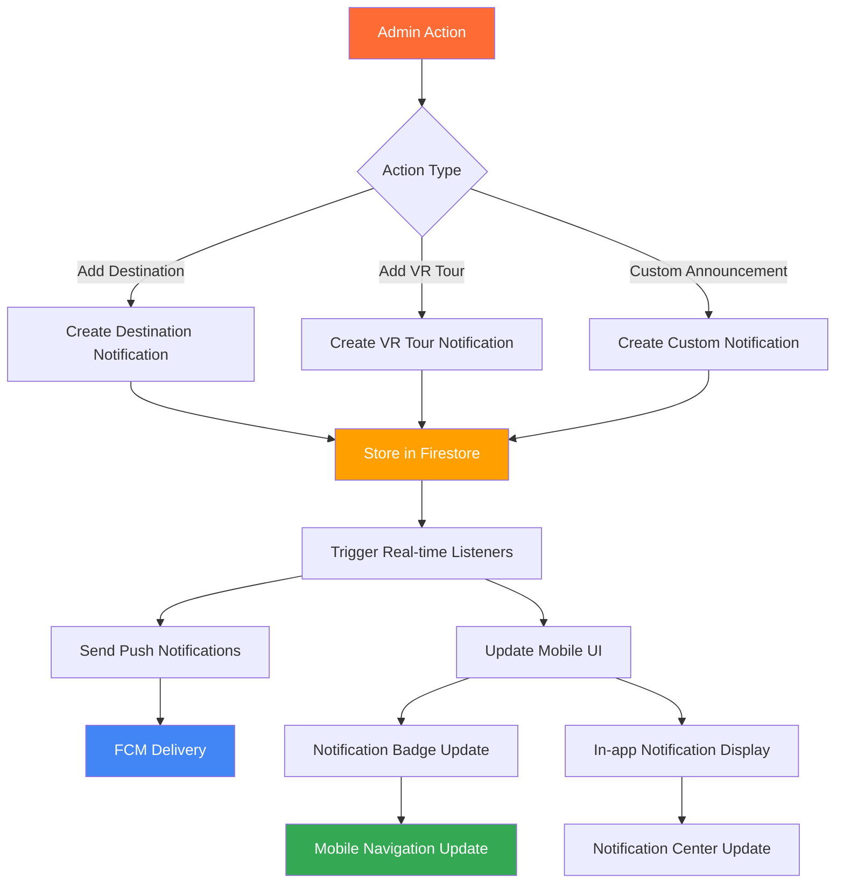
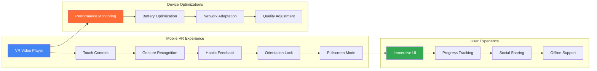
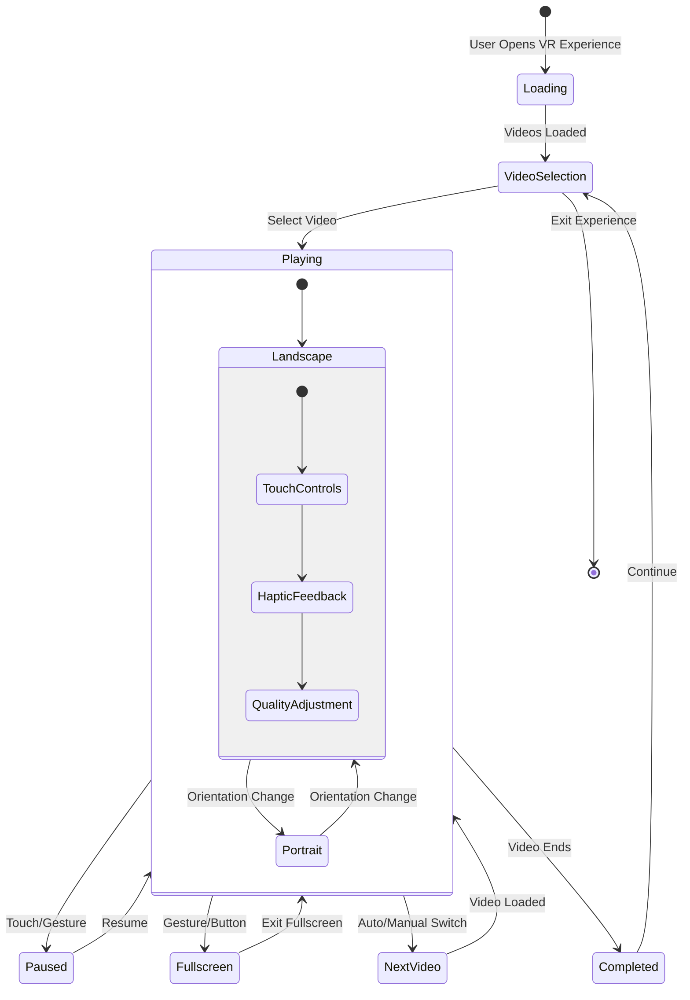

# Notification System Integration & Mobile VR Experience Enhancement

## Overview

This design document outlines the implementation of a comprehensive notification system that automatically notifies users when admins announce or add new destinations/VR tours through the admin panel, along with enhancements to the mobile VR experience. The system will be fully integrated with Firebase Firestore to ensure real-time notifications and an optimized mobile VR experience without booking functionality.

## Architecture

### System Components Architecture



### Mobile VR Experience Flow



## Notification System Components

### 1. Notification Data Models

```typescript
interface Notification {
  id: string;
  title: string;
  message: string;
  type: 'destination' | 'vr_tour' | 'announcement' | 'system';
  category: 'new_content' | 'update' | 'promotion' | 'maintenance';
  priority: 'low' | 'medium' | 'high' | 'urgent';
  targetAudience: 'all' | 'premium' | 'specific';
  targetUserIds?: string[];
  relatedContentId?: string;
  relatedContentType?: 'destination' | 'video' | 'tour';
  createdAt: Timestamp;
  expiresAt?: Timestamp;
  isRead: boolean;
  userId: string;
  adminId: string;
  metadata: {
    actionUrl?: string;
    imageUrl?: string;
    customData?: Record<string, any>;
  };
}

interface AnnouncementTemplate {
  id: string;
  type: 'destination' | 'vr_tour';
  titleTemplate: string;
  messageTemplate: string;
  isActive: boolean;
  createdBy: string;
  createdAt: Timestamp;
}
```

### 2. Notification Service Architecture

```typescript
class NotificationService {
  // Automatic notification triggers
  triggerDestinationNotification(destination: Destination, adminId: string)
  triggerVRTourNotification(video: Video, adminId: string)
  triggerCustomAnnouncement(announcement: CustomAnnouncement, adminId: string)
  
  // Notification management
  createNotification(notificationData: CreateNotificationData)
  getUserNotifications(userId: string, filters?: NotificationFilters)
  markAsRead(notificationId: string, userId: string)
  markAllAsRead(userId: string)
  deleteNotification(notificationId: string)
  
  // Real-time subscription
  subscribeToUserNotifications(userId: string, callback: (notifications: Notification[]) => void)
  
  // Push notification integration
  sendPushNotification(notification: Notification, userTokens: string[])
  scheduleNotification(notification: Notification, scheduleTime: Date)
}
```

### 3. Real-time Notification Flow



## Mobile VR Experience Enhancement

### 1. Mobile VR Component Architecture

```typescript
interface MobileVRExperience {
  // Core VR functionality
  destination: Destination;
  videos: Video[];
  currentVideoIndex: number;
  isFullscreen: boolean;
  isLandscape: boolean;
  
  // Mobile-specific features
  touchGestures: TouchGestureHandler;
  hapticFeedback: HapticFeedbackController;
  deviceOptimizations: DeviceOptimizations;
  orientationLock: OrientationLockController;
  
  // VR experience controls
  playVideo(): void;
  pauseVideo(): void;
  switchVideo(index: number): void;
  enterFullscreen(): void;
  exitFullscreen(): void;
  toggleLandscape(): void;
  
  // Analytics and tracking
  trackVREngagement(metrics: VRMetrics): void;
  recordViewTime(duration: number): void;
  logInteraction(interaction: VRInteraction): void;
}
```

### 2. Mobile VR Features Integration



### 3. Mobile VR Experience Flow



## Firebase Firestore Integration

### 1. Database Schema Design

```typescript
// Collections Structure
interface FirestoreSchema {
  // Existing collections
  destinations: Collection<Destination>;
  videos: Collection<Video>;
  users: Collection<UserProfile>;
  
  // New notification collections
  notifications: Collection<Notification>;
  userNotifications: Collection<UserNotification>;
  notificationTemplates: Collection<AnnouncementTemplate>;
  deviceTokens: Collection<DeviceToken>;
  
  // Analytics collections
  vrAnalytics: Collection<VRAnalytics>;
  notificationAnalytics: Collection<NotificationAnalytics>;
}

interface UserNotification {
  id: string;
  userId: string;
  notificationId: string;
  isRead: boolean;
  readAt?: Timestamp;
  receivedAt: Timestamp;
  clickedAt?: Timestamp;
  dismissed: boolean;
  dismissedAt?: Timestamp;
}

interface DeviceToken {
  id: string;
  userId: string;
  token: string;
  platform: 'web' | 'android' | 'ios';
  isActive: boolean;
  lastUsed: Timestamp;
  createdAt: Timestamp;
}
```

### 2. Firestore Security Rules

```javascript
// Security rules for notification system
rules_version = '2';
service cloud.firestore {
  match /databases/{database}/documents {
    // Notifications - admin write, user read
    match /notifications/{notificationId} {
      allow read: if request.auth != null;
      allow write: if isAdmin(request.auth.uid);
    }
    
    // User notifications - user-specific access
    match /userNotifications/{userNotificationId} {
      allow read, write: if request.auth != null 
        && request.auth.uid == resource.data.userId;
    }
    
    // Device tokens - user-specific access
    match /deviceTokens/{tokenId} {
      allow read, write: if request.auth != null 
        && request.auth.uid == resource.data.userId;
    }
    
    // VR Analytics - user-specific write, admin read
    match /vrAnalytics/{analyticsId} {
      allow write: if request.auth != null 
        && request.auth.uid == resource.data.userId;
      allow read: if isAdmin(request.auth.uid);
    }
    
    function isAdmin(uid) {
      return get(/databases/$(database)/documents/users/$(uid)).data.role == 'admin';
    }
  }
}
```

### 3. Real-time Listeners Implementation

```typescript
class FirebaseNotificationService {
  // Subscribe to user notifications
  subscribeToUserNotifications(
    userId: string, 
    callback: (notifications: Notification[]) => void
  ): () => void {
    const q = query(
      collection(db, 'userNotifications'),
      where('userId', '==', userId),
      where('dismissed', '==', false),
      orderBy('receivedAt', 'desc'),
      limit(50)
    );
    
    return onSnapshot(q, async (snapshot) => {
      const userNotifications = snapshot.docs.map(doc => ({
        id: doc.id,
        ...doc.data()
      })) as UserNotification[];
      
      // Fetch full notification details
      const notifications = await Promise.all(
        userNotifications.map(async (userNotif) => {
          const notifDoc = await getDoc(
            doc(db, 'notifications', userNotif.notificationId)
          );
          return {
            ...notifDoc.data(),
            id: notifDoc.id,
            isRead: userNotif.isRead,
            receivedAt: userNotif.receivedAt
          } as Notification;
        })
      );
      
      callback(notifications);
    });
  }
  
  // Real-time destination updates
  subscribeToDestinationUpdates(
    callback: (destinations: Destination[]) => void
  ): () => void {
    const q = query(
      collection(db, 'destinations'),
      where('isActive', '==', true),
      orderBy('updatedAt', 'desc')
    );
    
    return onSnapshot(q, (snapshot) => {
      const destinations = snapshot.docs.map(doc => ({
        id: doc.id,
        ...doc.data()
      })) as Destination[];
      
      callback(destinations);
    });
  }
}
```

## Admin Panel Integration

### 1. Automatic Notification Triggers

```typescript
interface AdminPanelNotificationTriggers {
  // Destination management triggers
  onDestinationCreate(destination: Destination): Promise<void>;
  onDestinationUpdate(destination: Destination): Promise<void>;
  onDestinationPublish(destinationId: string): Promise<void>;
  
  // VR Tour management triggers
  onVRTourCreate(video: Video): Promise<void>;
  onVRTourUpdate(video: Video): Promise<void>;
  onVRTourPublish(videoId: string): Promise<void>;
  
  // Custom announcement triggers
  onCustomAnnouncement(announcement: CustomAnnouncement): Promise<void>;
  onScheduledAnnouncement(announcement: ScheduledAnnouncement): Promise<void>;
}

class AdminNotificationManager {
  async onDestinationCreate(destination: Destination): Promise<void> {
    const notification: CreateNotificationData = {
      title: `New Destination: ${destination.name}`,
      message: `Discover the beauty of ${destination.name} in ${destination.location}. Start exploring now!`,
      type: 'destination',
      category: 'new_content',
      priority: 'medium',
      targetAudience: 'all',
      relatedContentId: destination.id,
      relatedContentType: 'destination',
      metadata: {
        actionUrl: `/destinations/${destination.id}`,
        imageUrl: destination.image
      }
    };
    
    await this.notificationService.createNotification(notification);
  }
  
  async onVRTourCreate(video: Video): Promise<void> {
    const destination = await getDestination(video.destinationId);
    
    const notification: CreateNotificationData = {
      title: `New VR Experience: ${video.title}`,
      message: `Immerse yourself in a 360° virtual tour of ${destination?.name}. Experience it now!`,
      type: 'vr_tour',
      category: 'new_content',
      priority: 'high',
      targetAudience: 'all',
      relatedContentId: video.id,
      relatedContentType: 'video',
      metadata: {
        actionUrl: `/vr-tours/${video.id}`,
        imageUrl: video.thumbnailUrl
      }
    };
    
    await this.notificationService.createNotification(notification);
  }
}
```

### 2. Admin Notification Dashboard

```typescript
interface AdminNotificationDashboard {
  // Notification management
  createCustomNotification(notification: CustomNotificationData): Promise<void>;
  scheduleNotification(notification: ScheduledNotificationData): Promise<void>;
  editNotificationTemplate(templateId: string, template: AnnouncementTemplate): Promise<void>;
  
  // Analytics and insights
  getNotificationMetrics(dateRange: DateRange): Promise<NotificationMetrics>;
  getUserEngagementStats(): Promise<UserEngagementStats>;
  getDeliveryReports(): Promise<DeliveryReport[]>;
  
  // Audience management
  createUserSegment(segment: UserSegment): Promise<void>;
  getTargetAudience(criteria: AudienceCriteria): Promise<string[]>;
  sendTestNotification(notification: TestNotification): Promise<void>;
}
```

## Mobile Experience Optimizations

### 1. Device-Specific Adaptations

```typescript
interface MobileOptimizations {
  // Performance optimizations
  adaptVideoQuality(networkSpeed: NetworkSpeed, deviceCapabilities: DeviceCapabilities): VideoQuality;
  preloadContent(priority: ContentPriority[]): Promise<void>;
  optimizeBatteryUsage(vrSession: VRSession): void;
  
  // User experience enhancements
  enableHapticFeedback(interaction: VRInteraction): void;
  adaptUIForOrientation(orientation: DeviceOrientation): void;
  optimizeForScreenSize(screenDimensions: ScreenDimensions): void;
  
  // Network optimizations
  implementOfflineMode(content: OfflineContent[]): void;
  adaptToConnectionSpeed(speed: ConnectionSpeed): void;
  prioritizeContentLoading(priority: LoadingPriority): void;
}
```

### 2. Progressive Web App Features

```typescript
interface PWANotificationFeatures {
  // Service worker integration
  registerServiceWorker(): Promise<ServiceWorkerRegistration>;
  enableBackgroundSync(): void;
  implementOfflineNotifications(): void;
  
  // Push notification support
  requestNotificationPermission(): Promise<NotificationPermission>;
  subscribeToPushNotifications(): Promise<PushSubscription>;
  handleBackgroundNotifications(event: PushEvent): void;
  
  // App badge and shortcuts
  updateAppBadge(count: number): void;
  createDynamicShortcuts(content: ShortcutContent[]): void;
  handleNotificationActions(action: NotificationAction): void;
}
```

## Testing Strategy

### 1. Unit Testing

```typescript
describe('NotificationService', () => {
  test('should create destination notification', async () => {
    const destination = createMockDestination();
    const notification = await notificationService.triggerDestinationNotification(
      destination, 
      'admin-123'
    );
    
    expect(notification.type).toBe('destination');
    expect(notification.relatedContentId).toBe(destination.id);
  });
  
  test('should send real-time updates', async () => {
    const userId = 'user-123';
    const mockCallback = jest.fn();
    
    const unsubscribe = notificationService.subscribeToUserNotifications(
      userId, 
      mockCallback
    );
    
    await notificationService.createNotification(createMockNotification());
    
    expect(mockCallback).toHaveBeenCalled();
    unsubscribe();
  });
});

describe('MobileVRExperience', () => {
  test('should handle touch gestures', () => {
    const vrExperience = render(<MobileVRExperience {...mockProps} />);
    const touchArea = vrExperience.getByTestId('vr-touch-area');
    
    fireEvent.touchStart(touchArea, createTouchEvent());
    fireEvent.touchMove(touchArea, createTouchEvent());
    fireEvent.touchEnd(touchArea, createTouchEvent());
    
    expect(mockOnGesture).toHaveBeenCalled();
  });
  
  test('should adapt to orientation changes', () => {
    const vrExperience = render(<MobileVRExperience {...mockProps} />);
    
    fireEvent(window, new Event('orientationchange'));
    
    expect(vrExperience.container.className).toContain('landscape');
  });
});
```

### 2. Integration Testing

```typescript
describe('Firebase Integration', () => {
  test('should sync notifications in real-time', async () => {
    const admin = createMockAdmin();
    const user = createMockUser();
    
    // Admin creates destination
    const destination = await admin.createDestination(mockDestinationData);
    
    // Check if notification is created
    const notifications = await getNotificationsForUser(user.id);
    expect(notifications).toHaveLength(1);
    expect(notifications[0].type).toBe('destination');
  });
  
  test('should handle offline scenarios', async () => {
    // Simulate offline mode
    goOffline();
    
    const vrExperience = render(<MobileVRExperience {...offlineProps} />);
    
    expect(vrExperience.getByText('Offline Mode')).toBeInTheDocument();
    
    // Go back online
    goOnline();
    
    await waitFor(() => {
      expect(vrExperience.getByText('Connected')).toBeInTheDocument();
    });
  });
});
```

### 3. End-to-End Testing

```typescript
describe('Complete User Journey', () => {
  test('admin creates destination -> user receives notification -> user explores VR', async () => {
    // Step 1: Admin creates destination
    await adminPage.createDestination({
      name: 'Test Destination',
      location: 'Test Location',
      vrAvailable: true
    });
    
    // Step 2: User receives notification
    await userPage.waitForNotification();
    const notification = await userPage.getLatestNotification();
    expect(notification.title).toContain('Test Destination');
    
    // Step 3: User clicks notification
    await userPage.clickNotification(notification.id);
    
    // Step 4: VR experience opens
    await vrPage.waitForVRExperience();
    expect(await vrPage.isVRExperienceVisible()).toBe(true);
    
    // Step 5: User interacts with VR
    await vrPage.playVideo();
    await vrPage.enableFullscreen();
    
    // Verify analytics tracking
    const analytics = await getVRAnalytics();
    expect(analytics.sessionCount).toBe(1);
  });
});
```