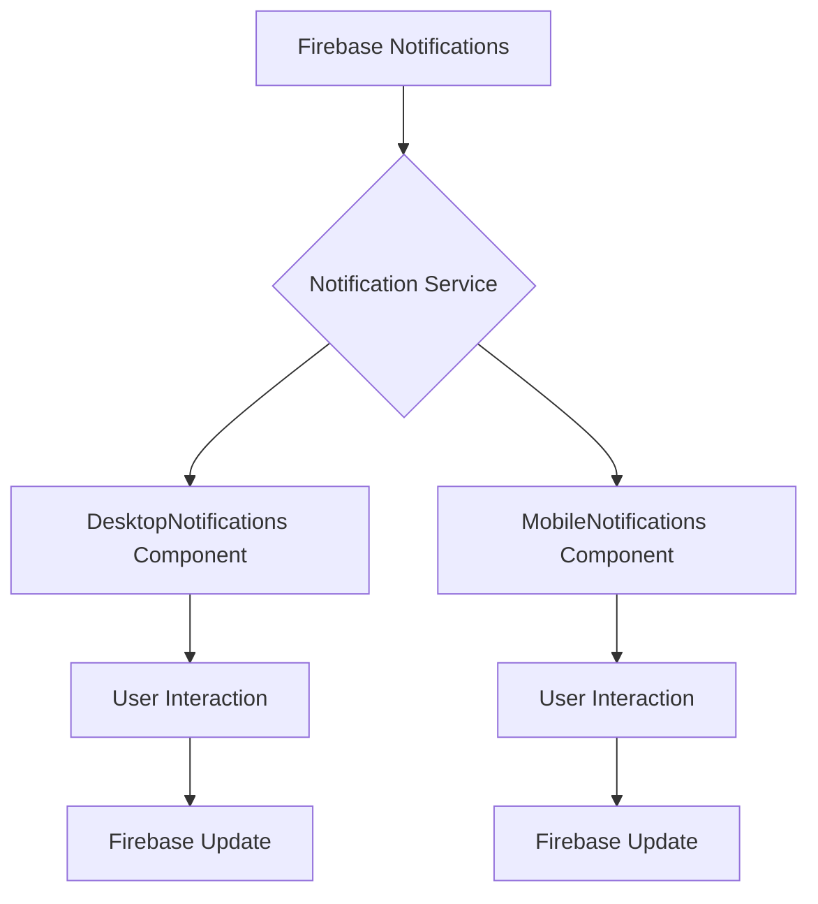
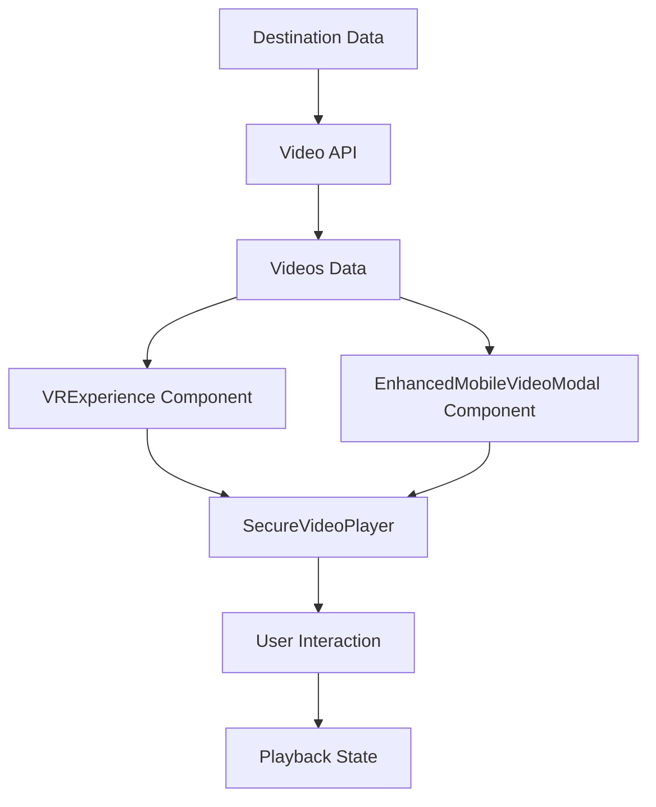

# Notification UI Update and VRExperience Video Modal Redesign

## Overview

This design document outlines the updates to the notification system UI and the redesign of the VRExperience video modal for both desktop and mobile platforms. The changes include:

1. Modifying notification components to show "No notifications" instead of infinite rotation when there are no notifications
2. Redesigning the VRExperience video modal to resemble YouTube's interface for both desktop and mobile platforms

## Technology Stack

- React 18+ with TypeScript
- Framer Motion for animations
- Lucide React for icons
- Tailwind CSS for styling
- Firebase for real-time notifications
- YouTube iframe API for video playback

## Architecture

### Current Notification System Architecture

The notification system consists of two main components:
- `DesktopNotifications.tsx`: Handles desktop notification display
- `MobileNotifications.tsx`: Handles mobile notification display

Both components use:
- Real-time subscription to Firebase notifications
- Filtering capabilities (all/unread)
- Mark as read/dismiss functionality
- Responsive design with animations

### Current VRExperience Architecture

The VR experience system consists of:
- `VRExperience.tsx`: Desktop VR experience modal
- `MobileVRExperience.tsx`: Mobile VR experience wrapper
- `EnhancedMobileVideoModal.tsx`: Mobile video modal implementation
- `SecureVideoPlayer.tsx`: Core video player component supporting both YouTube and HTML5 video

The video player supports:
- YouTube iframe API integration
- HTML5 video playback
- Custom controls with keyboard shortcuts
- Responsive design for all screen sizes
- Picture-in-Picture support
- Fullscreen mode

## UI/UX Improvements

### Notification UI Updates

#### Problem
Currently, when there are no notifications, the system shows a rotating loader indefinitely, which can confuse users.

#### Solution
Replace the infinite loader with a clear "No notifications" message when there are no notifications to display.

#### Desktop Notifications Changes
1. Modify the empty state in `DesktopNotifications.tsx`:
   - Replace loading spinner with clear "No notifications" message
   - Add appropriate iconography (Bell icon)
   - Include helpful text to guide users
   - Maintain consistent styling with filtered empty states
   - Add visual hierarchy with proper spacing and typography

2. Update the loading state:
   - Show loader only during initial data fetch
   - Implement proper error handling
   - Add timeout handling for slow network conditions

3. Improve overall UX:
   - Add skeleton loading states for better perceived performance
   - Implement smoother animations for notification transitions
   - Enhance notification card design with better visual hierarchy

#### Mobile Notifications Changes
1. Modify the empty state in `MobileNotifications.tsx`:
   - Replace loading spinner with clear "No notifications" message
   - Add appropriate iconography (Bell icon)
   - Include helpful text to guide users
   - Maintain consistent styling with filtered empty states
   - Optimize for mobile touch interactions

2. Update the loading state:
   - Show loader only during initial data fetch
   - Implement proper error handling
   - Add timeout handling for slow network conditions

3. Improve overall UX:
   - Add skeleton loading states for better perceived performance
   - Implement smoother animations for notification transitions
   - Enhance notification card design with better visual hierarchy
   - Optimize swipe gestures for dismiss actions

### VRExperience Video Modal Redesign

#### Problem
The current video modal doesn't provide a YouTube-like experience that users are familiar with, especially on mobile devices.

#### Solution
Redesign both desktop and mobile video modals to follow YouTube's UI patterns while maintaining the existing functionality.

#### Desktop VRExperience Changes
1. Redesign the video player interface:
   - Implement YouTube-like controls layout with progress bar, play/pause, volume
   - Improve video information display with title, views, and description
   - Enhance playlist navigation with thumbnail previews
   - Optimize fullscreen experience with minimal controls
   - Add keyboard shortcuts overlay
   - Implement modern glass morphism effects for controls

2. Update the sidebar:
   - Reorganize information hierarchy with video description at top
   - Improve action button placement with like, share, and save options
   - Enhance video playlist presentation with horizontal scrolling
   - Add related videos section
   - Implement collapsible sections for better space management
   - Add engagement metrics (views, likes, upload date)

3. Enhance overall UX:
   - Implement smooth transitions between videos
   - Add hover effects for interactive elements
   - Improve accessibility with proper ARIA labels
   - Add loading skeletons for better perceived performance

#### Mobile VRExperience Changes
1. Redesign the mobile video modal:
   - Implement YouTube-like mobile interface with swipe gestures
   - Improve orientation handling with auto-rotation prompts
   - Enhance touch controls with larger tap targets
   - Optimize for both portrait and landscape modes with adaptive layouts
   - Add mobile-specific features like picture-in-picture
   - Implement haptic feedback for interactions

2. Update the bottom sheet:
   - Reorganize content for better mobile UX with scrollable sections
   - Improve video selection carousel with swipe gestures
   - Enhance action button layout with floating action buttons
   - Add mobile-specific controls like screen rotation
   - Implement pull-to-close gesture

3. Enhance overall mobile UX:
   - Implement skeleton loaders for better perceived performance
   - Add haptic feedback for key interactions
   - Optimize for different screen sizes
   - Improve touch target sizes for accessibility
   - Add offline support indicators

## Component Structure

### Notification Components

#### DesktopNotifications.tsx
- Props: `isOpen`, `onClose`
- State: notifications, isLoading, error, filter
- Key functions: 
  - `handleMarkAsRead`
  - `handleMarkAllAsRead`
  - `handleDismissNotification`
  - `handleNotificationClick`

#### MobileNotifications.tsx
- Props: `isOpen`, `onClose`
- State: notifications, isLoading, error, filter
- Key functions:
  - `handleMarkAsRead`
  - `handleMarkAllAsRead`
  - `handleDismissNotification`
  - `handleNotificationClick`

### VRExperience Components

#### VRExperience.tsx
- Props: `destination`, `isOpen`, `onClose`
- State: videos, currentVideoIndex, previewTime, etc.
- Key functions:
  - `handlePaymentSuccess`
  - `changeVideo`
  - `toggleFullscreen`
  - Video playback handlers

#### EnhancedMobileVideoModal.tsx
- Props: `destination`, `isOpen`, `onClose`
- State: videos, currentVideoIndex, previewTime, etc.
- Key functions:
  - `handleRotateScreen`
  - `changeVideo`
  - `handlePaymentSuccess`

#### SecureVideoPlayer.tsx
- Props: Multiple video configuration options
- State: Player state, controls visibility, etc.
- Key functions:
  - `handlePlayPause`
  - `handleSeek`
  - `handleVolumeChange`
  - `handleFullscreenToggle`

## Data Flow

### Notification System

### VRExperience System

## Implementation Plan

### Phase 1: Notification UI Updates

1. Update `DesktopNotifications.tsx`:
   - Modify empty state rendering to show "No notifications" message instead of infinite loader
   - Update loading state to only show during initial data fetch
   - Ensure consistent styling with existing components
   - Maintain existing filter functionality (All/Unread)
   - Preserve real-time update capabilities

2. Update `MobileNotifications.tsx`:
   - Modify empty state rendering to show "No notifications" message instead of infinite loader
   - Update loading state to only show during initial data fetch
   - Ensure responsive design is maintained
   - Maintain existing filter functionality (All/Unread)
   - Preserve real-time update capabilities

### Phase 2: Desktop VRExperience Redesign

1. Redesign `VRExperience.tsx`:
   - Update video player controls to match YouTube's design with modern styling
   - Reorganize sidebar information layout with video description at top
   - Improve playlist navigation with thumbnail previews
   - Enhance fullscreen mode experience with minimal overlay controls
   - Add keyboard shortcuts help panel
   - Implement settings menu for quality and speed selection

2. Update styling:
   - Implement YouTube-like dark theme with red accent colors
   - Improve typography hierarchy with better font sizing
   - Enhance hover states and transitions for interactive elements
   - Add glass morphism effects for modern UI

### Phase 3: Mobile VRExperience Redesign

1. Redesign `EnhancedMobileVideoModal.tsx`:
   - Update video player controls to match YouTube's mobile design
   - Improve orientation handling with auto-rotation prompts
   - Enhance touch interactions with larger tap targets
   - Optimize for both portrait and landscape modes
   - Add mobile-specific gestures like swipe to close
   - Implement picture-in-picture support

2. Update bottom sheet:
   - Reorganize content layout with scrollable sections
   - Improve video selection carousel with horizontal scrolling
   - Enhance action buttons with floating action button design
   - Add mobile-specific controls like screen rotation
   - Implement pull-to-close gesture for better UX

## Testing Strategy

### Notification UI Testing
1. Unit tests for empty state rendering
   - Test empty state for all filter modes (All, Unread)
   - Test loading state behavior
   - Test error state handling
2. Integration tests for notification filtering
   - Test real-time notification updates
   - Test filter switching functionality
   - Test mark as read/dismiss actions
3. Cross-browser testing for consistent rendering
   - Test on Chrome, Firefox, Safari, Edge
   - Test on different screen sizes
4. Accessibility testing for screen readers
   - Test keyboard navigation
   - Test ARIA labels and roles
   - Test color contrast ratios

### VRExperience Testing
1. Unit tests for video player controls
   - Test play/pause functionality
   - Test volume controls
   - Test fullscreen toggle
   - Test seek functionality
2. Integration tests for video playback
   - Test YouTube video loading
   - Test video quality selection
   - Test playback speed controls
3. Cross-device testing for responsive design
   - Test on desktop, tablet, and mobile
   - Test in portrait and landscape modes
   - Test on different operating systems
4. Performance testing for video loading
   - Test initial load times
   - Test buffering performance
   - Test memory usage
5. Accessibility testing for keyboard navigation
   - Test keyboard shortcuts
   - Test screen reader compatibility
   - Test focus management

## Dependencies

1. React 18+
2. TypeScript
3. Framer Motion for animations
4. Lucide React for icons
5. Firebase for real-time notifications
6. YouTube iframe API for video playback

## Performance Considerations

1. Optimize rendering of notification lists
2. Implement virtual scrolling for large notification lists
3. Optimize video loading and buffering
4. Reduce bundle size by code splitting components
5. Implement proper error boundaries

## Security Considerations

1. Maintain existing video security measures
2. Ensure proper authentication for premium content
3. Validate all user inputs
4. Sanitize notification content before rendering

## Conclusion

This design document outlines the necessary updates to improve the notification UI and VRExperience video modal. The changes will provide a better user experience by:

1. Eliminating confusion with infinite loading states in the notification system
2. Providing a familiar YouTube-like interface for video content
3. Enhancing both desktop and mobile experiences
4. Maintaining all existing functionality while improving the UI/UX

The implementation will be done in phases to ensure stability and allow for proper testing of each component. The changes will improve user satisfaction and engagement with the platform.