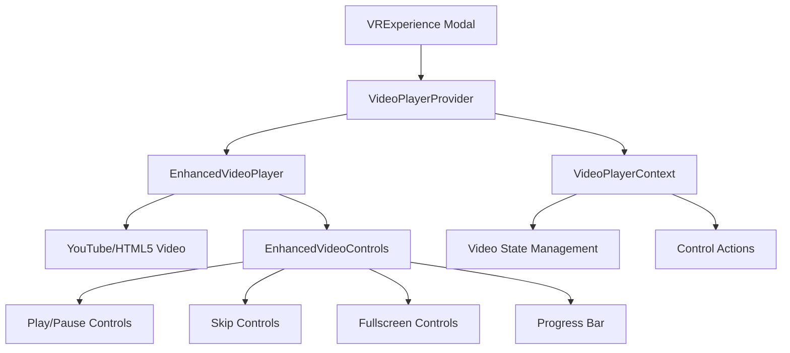
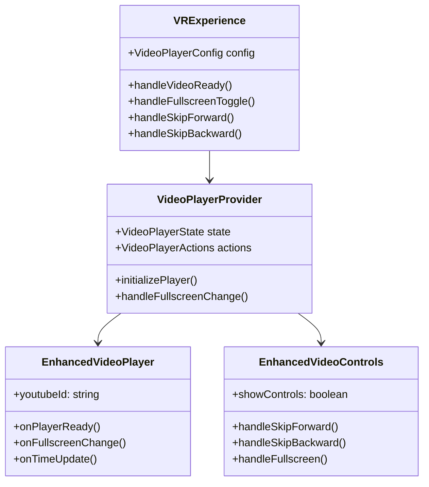

# Video Modal Issues Fix Design

## Overview

This design addresses critical issues in the VR Experience video modal component affecting both mobile and desktop platforms. The main problems include video not displaying properly, non-functional fullscreen button, malfunctioning skip buttons (10s forward/backward), and improper modal fitting for both video content and overview text sections.

## Current Architecture Analysis

### VR Experience Components
- **Desktop**: `VRExperience.tsx` - Modal-based VR video player
- **Mobile**: `MobileVRExperience.tsx` - Mobile-optimized fullscreen experience  
- **Video Player**: `EnhancedVideoPlayer.tsx` - Core video rendering component
- **Controls**: `EnhancedVideoControls.tsx` - Video control buttons and progress bar

### Video Player Context Architecture


## Root Cause Analysis

### Video Display Issues
1. **YouTube Player Integration**: Async player initialization may fail before video container is ready
2. **VideoPlayerProvider Missing**: VRExperience component doesn't wrap content with VideoPlayerProvider
3. **Container Sizing**: Modal video container lacks proper aspect ratio constraints

### Fullscreen Functionality Issues
1. **Browser Fullscreen API**: Missing cross-browser fullscreen event handling  
2. **Context Integration**: Fullscreen actions not properly connected to VideoPlayerContext
3. **Mobile vs Desktop**: Different fullscreen behaviors not unified

### Skip Button Issues
1. **Control Integration**: Skip buttons reference actions that may not be properly initialized
2. **Time Seeking**: YouTube API seek operations not handling edge cases
3. **UI State Sync**: Skip operations not updating video progress correctly

### Modal Fitting Issues
1. **Responsive Design**: Fixed modal size doesn't adapt to different screen sizes
2. **Content Layout**: Video and text content compete for space inefficiently
3. **Hover Behavior**: Overview text scaling affects modal layout stability

## Technical Architecture

### Enhanced Video Player Integration


### Video Player Context Enhancement
```typescript
interface VideoPlayerActions {
  play: () => void;
  pause: () => void;
  seek: (time: number) => void;
  skipForward: (seconds: number) => void;
  skipBackward: (seconds: number) => void;
  toggleFullscreen: () => void;
  setQuality: (quality: string) => void;
}

interface VideoPlayerState {
  isPlaying: boolean;
  currentTime: number;
  duration: number;
  isFullscreen: boolean;
  isReady: boolean;
  hasError: boolean;
}
```

## Component Modifications

### VRExperience Component Updates
1. **VideoPlayerProvider Wrapper**: Wrap video content with proper context provider
2. **Modal Responsive Layout**: Implement adaptive sizing based on viewport
3. **Video Container Constraints**: Add proper aspect ratio and sizing controls
4. **Error Handling**: Improve video loading and error state management

### EnhancedVideoPlayer Improvements  
1. **Player Ready State**: Ensure player initialization before enabling controls
2. **Cross-Platform Support**: Unified YouTube and HTML5 video handling
3. **Fullscreen API**: Implement cross-browser fullscreen functionality
4. **Time Synchronization**: Proper currentTime/duration tracking

### EnhancedVideoControls Enhancements
1. **Skip Button Implementation**: Add proper 10s forward/backward functionality
2. **Fullscreen Button Logic**: Connect to VideoPlayerContext fullscreen actions
3. **Control State Management**: Ensure controls reflect actual video state
4. **Touch-Friendly Controls**: Larger touch targets for mobile devices

### Modal Layout Redesign
1. **Flexible Container**: Dynamic sizing based on content and viewport
2. **Video-First Layout**: Prioritize video display area
3. **Collapsible Sidebar**: Make overview text section collapsible
4. **Responsive Breakpoints**: Different layouts for mobile/tablet/desktop

## Implementation Strategy

### Phase 1: Core Video Functionality
1. **VideoPlayerProvider Integration**
   - Wrap VRExperience content with VideoPlayerProvider
   - Configure proper video player settings
   - Implement error boundary handling

2. **Player Initialization Fix**
   - Add player ready state management
   - Implement retry mechanism for failed initializations  
   - Ensure proper cleanup on modal close

3. **Cross-Browser Fullscreen**
   - Implement fullscreen API with vendor prefixes
   - Add fullscreen change event listeners
   - Handle mobile fullscreen orientation changes

### Phase 2: Control System Enhancement
1. **Skip Button Implementation**
   - Add skipForward/skipBackward actions to VideoPlayerContext
   - Implement proper time bounds checking
   - Add visual feedback for skip operations

2. **Control State Synchronization**
   - Ensure controls reflect actual video state
   - Add loading states for control operations
   - Implement control auto-hide/show logic

3. **Touch Gesture Support**
   - Add double-tap for play/pause
   - Implement swipe gestures for seeking
   - Add pinch-to-zoom for video content

### Phase 3: Modal Layout Optimization
1. **Responsive Modal Design**
   - Implement viewport-aware sizing
   - Add breakpoint-specific layouts
   - Ensure proper aspect ratio maintenance

2. **Content Organization**
   - Video player takes 60-70% of modal width on desktop
   - Overview section becomes collapsible sidebar
   - Add smooth transitions for layout changes

3. **Mobile Optimization**
   - Full-screen modal on mobile devices
   - Bottom sheet design for overview content
   - Landscape mode optimizations

## Testing Strategy

### Unit Tests
- VideoPlayerContext actions and state management
- Skip button functionality with time boundaries
- Fullscreen API integration across browsers
- Modal responsive behavior at different screen sizes

### Integration Tests  
- VRExperience modal opening/closing
- Video player initialization and error handling
- Control interaction with underlying video player
- Mobile gesture integration

### Cross-Platform Testing
- YouTube video playback on different browsers
- Fullscreen functionality on mobile vs desktop
- Touch controls vs mouse interactions
- Various screen sizes and orientations

## Performance Considerations

### Video Loading Optimization
- Implement progressive loading strategies
- Add video quality selection based on connection speed  
- Preload video metadata for faster startup
- Optimize YouTube player initialization

### Mobile Performance
- Reduce control complexity on lower-end devices
- Implement battery usage optimizations
- Add performance monitoring for VR sessions
- Optimize gesture handling for smooth interactions

### Memory Management
- Proper cleanup of video player instances
- Remove event listeners on component unmount
- Prevent memory leaks from failed video loads
- Optimize video buffer management

## Error Handling Strategy

### Video Load Failures
- Retry mechanism with exponential backoff
- Fallback to different video sources if available
- User-friendly error messages with recovery options
- Analytics tracking for debugging video issues

### Fullscreen Failures
- Graceful degradation when fullscreen API unavailable
- Alternative "expand" mode for unsupported browsers
- Clear user feedback when fullscreen fails
- Automatic retry on orientation change

### Control Failures
- Disable non-functional controls with visual indicators
- Provide alternative interaction methods
- Log control failures for debugging
- Maintain core play/pause functionality as fallback