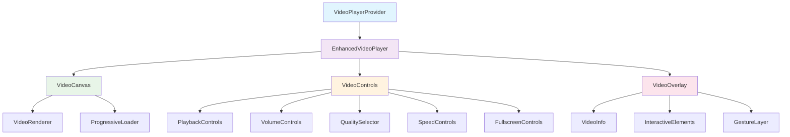
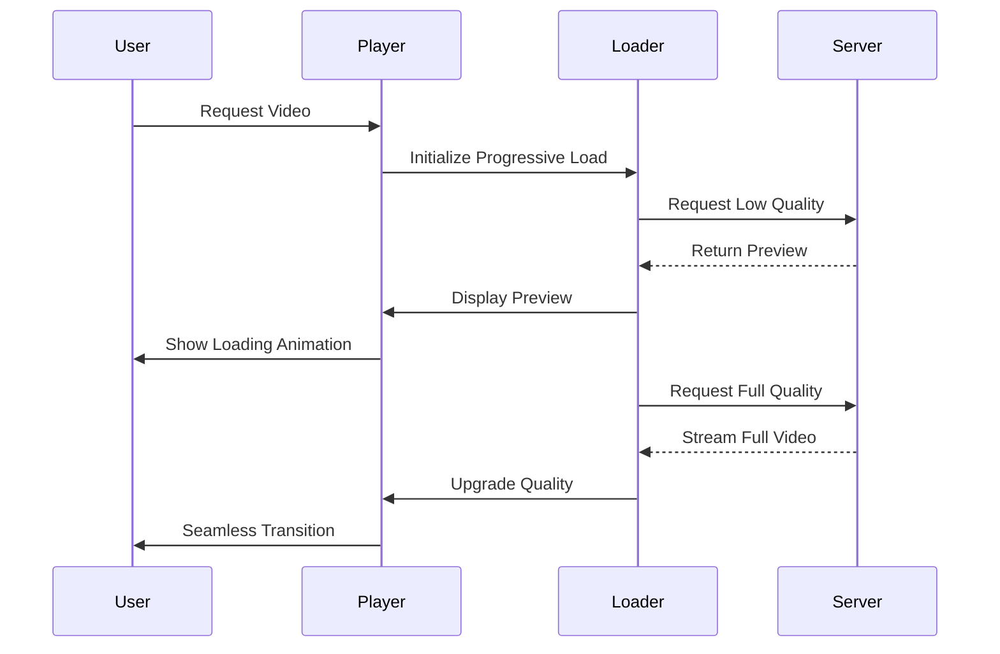
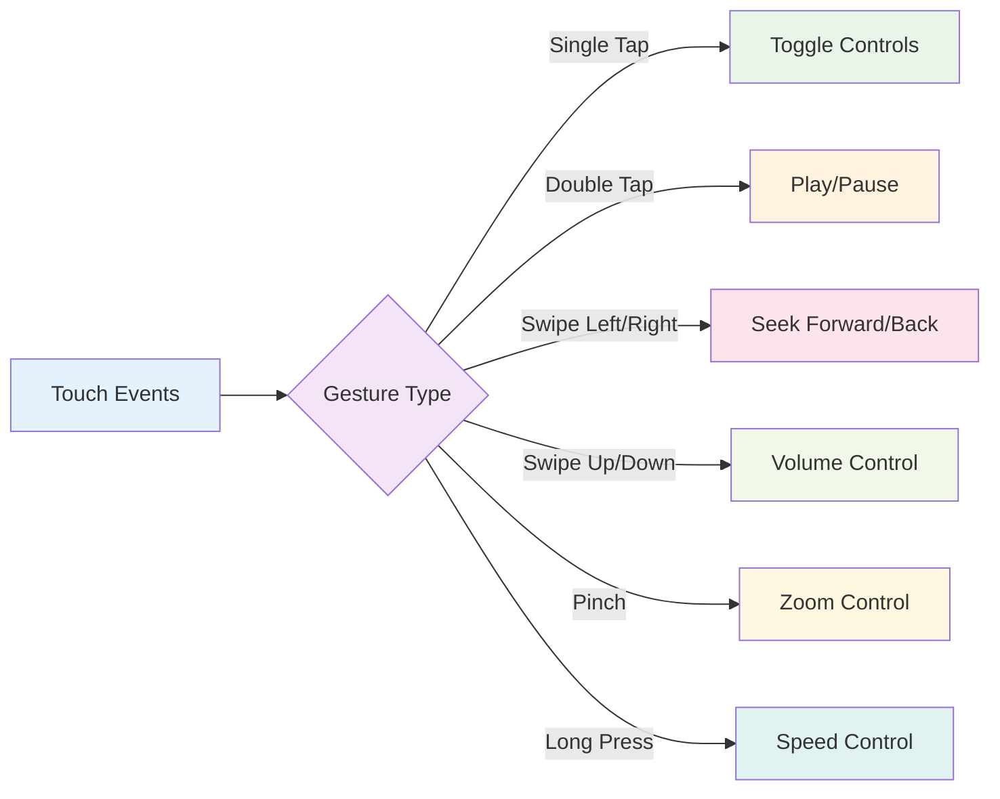
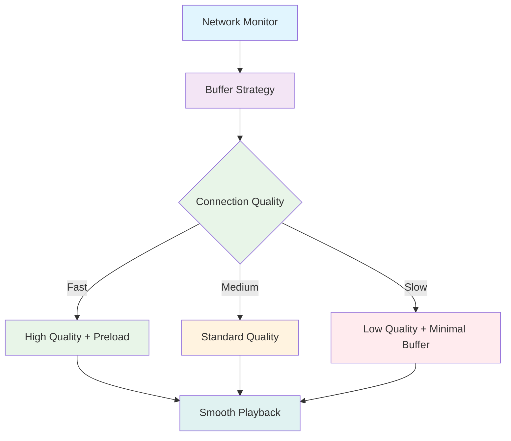

# Video Player Enhancement Design

## Overview

This design document outlines enhancements to the video player UI/UX and functionality for both desktop and mobile platforms. The goal is to create a snappy, smooth, and visually appealing video experience that leverages modern web technologies and optimizes performance across devices.

## Current State Analysis

### Existing Video Components
- **VRExperience.tsx**: Primary video player with YouTube API integration
- **MobileVRExperience.tsx**: Mobile-optimized video player
- **FeaturedVideo.tsx**: Simple iframe-based featured video display
- **Background videos**: Used in hero sections across various pages

### Current Limitations
- Basic YouTube iframe implementation with limited customization
- Inconsistent video controls across desktop and mobile
- Limited interactive features and visual effects
- Basic loading states without progressive enhancement
- No advanced playback features (speed control, quality selection)
- Limited gesture support for mobile devices

## Enhanced Video Player Architecture

### Component Hierarchy



### Enhanced Player Features

#### Core Video Engine
- **Custom Video Element**: Replace iframe with native HTML5 video for better control
- **Adaptive Streaming**: Support for multiple quality levels with automatic switching
- **Preloading Strategy**: Intelligent video preloading based on user behavior
- **Buffer Management**: Optimized buffering for smooth playback

#### Progressive Loading System


## Desktop Video Player Enhancements

### Advanced Controls Interface

#### Primary Control Bar
- **Sleek Design**: Glass morphism effect with backdrop blur
- **Hover Animations**: Smooth reveal animations with micro-interactions
- **Smart Auto-hide**: Context-aware visibility based on user activity
- **Customizable Layout**: Modular control components

#### Enhanced Playback Controls
- **Smooth Scrubbing**: Frame-accurate seeking with preview thumbnails
- **Playback Speed**: Variable speed control (0.25x to 2x) with smooth transitions
- **Quality Selection**: Automatic and manual quality switching
- **Chapter Navigation**: Support for video chapters with visual markers

#### Visual Enhancements
- **Custom Progress Bar**: Animated progress with buffer visualization
- **Volume Visualization**: Animated volume waves and level indicators
- **Loading Animations**: Skeleton screens and progressive loading indicators
- **Focus States**: Keyboard navigation with clear focus indicators

### Interactive Features

#### Picture-in-Picture Mode
- **Smart Positioning**: Automatic positioning avoiding UI elements
- **Drag & Resize**: Interactive resizing with snap-to-edge functionality
- **Context Preservation**: Maintain playback state and controls

#### Video Annotations
- **Interactive Hotspots**: Clickable areas with information overlays
- **Timed Text**: Dynamic text overlays synchronized with video content
- **Call-to-Action Overlays**: Engagement elements at strategic moments

## Mobile Video Player Enhancements

### Touch-Optimized Interface

#### Gesture Controls


#### Adaptive UI Elements
- **Large Touch Targets**: Minimum 44px touch targets for accessibility
- **Haptic Feedback**: Tactile responses for all interactions
- **Orientation Awareness**: Adaptive layouts for portrait/landscape modes
- **Screen Edge Gestures**: Edge swipes for navigation and controls

### Performance Optimizations

#### Mobile-Specific Features
- **Battery Optimization**: Intelligent quality reduction on low battery
- **Data Saving Mode**: Compressed video streams for cellular connections
- **Background Playback**: Audio-only mode for background listening
- **Offline Caching**: Smart caching for frequently watched content

#### Responsive Design
- **Breakpoint-Aware**: Fluid layouts adapting to various screen sizes
- **Safe Area Support**: Proper handling of notches and device-specific layouts
- **Dynamic Text Scaling**: Accessibility-compliant text sizing

## Advanced Video Features

### Smart Loading & Buffering

#### Intelligent Preloading
- **User Behavior Analysis**: Predict next video based on viewing patterns
- **Connection-Aware Loading**: Adjust quality based on network conditions
- **Progressive Enhancement**: Layer features based on device capabilities

#### Buffer Management


### Interactive Video Elements

#### Enhanced Overlays
- **Smart Positioning**: AI-powered overlay placement avoiding important content
- **Accessibility Integration**: Screen reader compatible overlays
- **Multi-language Support**: Localized overlay content

#### Video Analytics
- **Engagement Tracking**: Heatmaps of user interaction points
- **Performance Metrics**: Real-time playback quality and loading analytics
- **A/B Testing**: Interface variations for optimization

## Visual Design System

### Modern UI Components

#### Design Tokens
```typescript
interface VideoPlayerTheme {
  colors: {
    primary: '#FF6B35';
    secondary: '#2C5F6C';
    accent: '#F7931E';
    background: 'rgba(0, 0, 0, 0.8)';
    overlay: 'rgba(255, 255, 255, 0.1)';
  };
  spacing: {
    controls: '16px';
    margins: '24px';
    padding: '12px';
  };
  animations: {
    duration: '300ms';
    easing: 'cubic-bezier(0.4, 0, 0.2, 1)';
  };
  glassMorphism: {
    backdropFilter: 'blur(20px)';
    backgroundColor: 'rgba(255, 255, 255, 0.1)';
    border: '1px solid rgba(255, 255, 255, 0.2)';
  };
}
```

#### Animation Framework
- **Framer Motion Integration**: Smooth transitions and micro-interactions
- **CSS Custom Properties**: Dynamic theming and real-time updates
- **Hardware Acceleration**: GPU-optimized animations for performance

### Control Bar Design

#### Modern Control Layout
- **Minimal Design**: Clean, uncluttered interface
- **Contextual Visibility**: Show relevant controls based on content type
- **Smooth Transitions**: Fade in/out animations with proper timing
- **Glass Morphism**: Translucent controls with backdrop blur effects

## Implementation Architecture

### Component Structure

#### Enhanced Video Player Component
```typescript
interface EnhancedVideoPlayerProps {
  src: string | VideoSource[];
  poster?: string;
  autoplay?: boolean;
  controls?: boolean;
  quality?: 'auto' | '480p' | '720p' | '1080p' | '4K';
  speed?: number;
  chapters?: VideoChapter[];
  overlays?: VideoOverlay[];
  gestures?: boolean;
  pip?: boolean;
  analytics?: boolean;
  theme?: VideoPlayerTheme;
  onProgress?: (progress: number) => void;
  onQualityChange?: (quality: string) => void;
  onInteraction?: (event: InteractionEvent) => void;
}
```

#### State Management
- **Unified State**: Centralized video player state management
- **Context Providers**: Shared state across video components
- **Optimistic Updates**: Immediate UI feedback with background sync

### Performance Optimization

#### Code Splitting
- **Dynamic Imports**: Load video features on demand
- **Bundle Analysis**: Optimize chunk sizes for video components
- **Tree Shaking**: Remove unused video codecs and features

#### Memory Management
- **Video Element Pooling**: Reuse video elements for better performance
- **Garbage Collection**: Proper cleanup of video resources
- **Resource Monitoring**: Track memory usage and optimize accordingly

## Testing Strategy

### Automated Testing

#### Unit Tests
- Component rendering and props handling
- Control interactions and state changes
- Gesture recognition and response
- Video loading and error handling

#### Integration Tests
- Video playback across different formats
- Control synchronization with video state
- Mobile gesture integration
- Accessibility compliance

#### Performance Tests
- Loading time benchmarks
- Memory usage monitoring
- Frame rate analysis
- Network efficiency testing

### Cross-Platform Testing

#### Device Coverage
- **Desktop Browsers**: Chrome, Firefox, Safari, Edge
- **Mobile Devices**: iOS Safari, Android Chrome, Samsung Internet
- **Smart TVs**: WebOS, Tizen, Android TV
- **Accessibility Tools**: Screen readers, keyboard navigation

#### Network Conditions
- **Connection Speeds**: 3G, 4G, 5G, WiFi
- **Bandwidth Throttling**: Adaptive quality testing
- **Offline Scenarios**: Cached content playback
- **Intermittent Connectivity**: Graceful degradation

## Accessibility Implementation

### WCAG Compliance

#### Keyboard Navigation
- **Tab Order**: Logical focus sequence through video controls
- **Keyboard Shortcuts**: Standard media shortcuts (spacebar, arrow keys)
- **Focus Indicators**: Clear visual feedback for keyboard users
- **Skip Links**: Quick navigation to video content

#### Screen Reader Support
- **ARIA Labels**: Comprehensive labeling for all interactive elements
- **Live Regions**: Dynamic announcements for state changes
- **Alternative Text**: Descriptive text for visual elements
- **Captions**: Synchronized text alternatives for audio content

### Inclusive Design
- **High Contrast Mode**: Support for system high contrast settings
- **Reduced Motion**: Respect user preferences for animation
- **Font Scaling**: Proper text sizing with system font preferences
- **Color Independence**: Interface usable without color perception

## Integration Points

### Existing System Integration

#### Firebase Integration
- **Video Metadata**: Store enhanced video information
- **User Preferences**: Save playback settings and history
- **Analytics Data**: Track video engagement metrics
- **A/B Testing**: Feature flag management for experiments

#### YouTube API Enhancement
- **Quality API**: Access to video quality information
- **Captions API**: Retrieve closed caption data
- **Analytics API**: Enhanced video performance metrics
- **Embedding API**: Advanced embedding options

### Third-Party Services

#### CDN Integration
- **Video Delivery**: Optimized video streaming through CDN
- **Thumbnail Generation**: Automatic preview image creation
- **Adaptive Bitrate**: Multiple quality streams for different devices
- **Geographic Optimization**: Region-specific content delivery

## Migration Strategy

### Phased Implementation

#### Phase 1: Core Enhancement (Week 1-2)
- Replace iframe with native video element
- Implement basic custom controls
- Add loading states and error handling
- Mobile gesture foundation

#### Phase 2: Advanced Features (Week 3-4)
- Quality selection and adaptive streaming
- Picture-in-picture mode
- Enhanced mobile gestures
- Performance optimizations

#### Phase 3: Polish & Analytics (Week 5-6)
- Visual design refinements
- Accessibility compliance
- Analytics integration
- Testing and optimization

### Backward Compatibility
- **Graceful Degradation**: Fallback to current implementation if enhancement fails
- **Feature Detection**: Progressive enhancement based on browser capabilities
- **User Preferences**: Option to use classic video player interface
- **Performance Monitoring**: Automatic fallback for performance issues